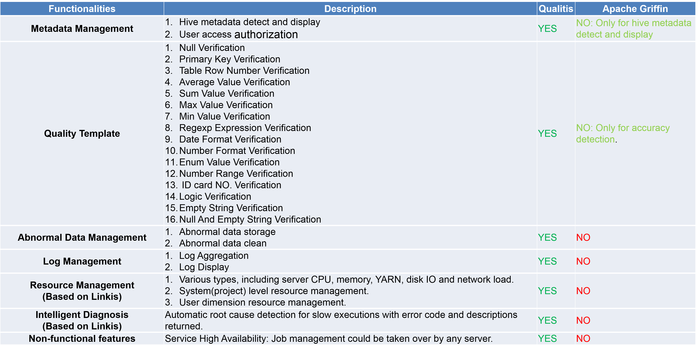
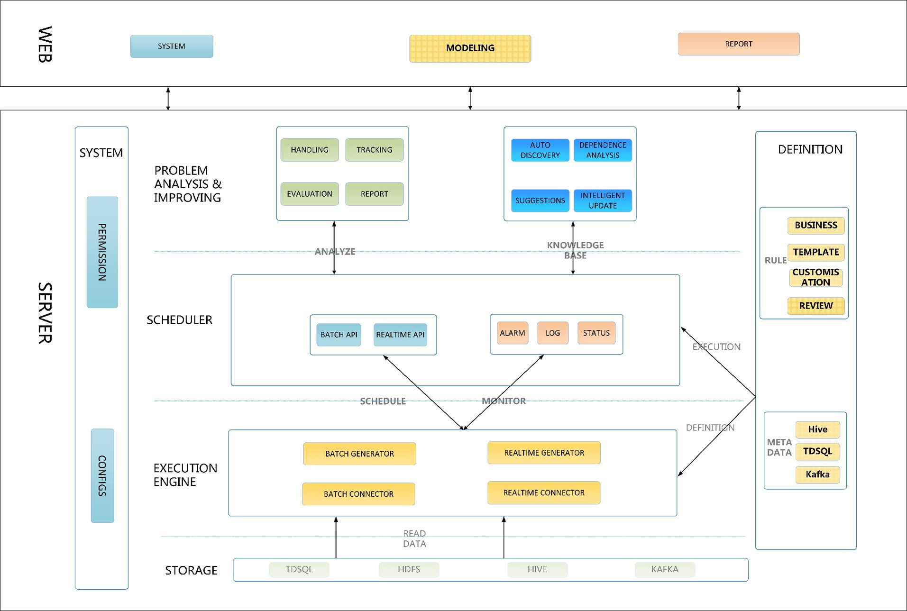

  

English | [中文](docs/zh_CN/ch1)  

## Overview
Qualitis is a data quality management platform that supports quality verification, notification, and management for various datasource. It is used to solve various data quality problems caused by data processing.

Based on Spring Boot, Qualitis submits quality model task to [Linkis](https://github.com/WeBankFinTech/Linkis) platform. It provides functions such as data quality model construction, data quality model execution, data quality verification, reports of data quality generation and so on.

At the same time, Qualitis provides enterprise-level features of financial-level resource isolation, management and access control. It is also guaranteed working well under high-concurrency, high-performance and high-availability scenarios.

## Features
- **Define Data Quality Model**  
Supports data quality model below:  
1.Model of single table.  
2.Model of multi-table.  
3.Custom model.  
  At the same time, Qualitis presets multiple data quality verification templates, including common checks such as null check, blank check, number check, enumeration check and so on, which simplifies data quality model definition.  

- **Data Quality Model Scheduling**  
Supports data quality model scheduling.  

- **Data Quality Report**  
Supports generating data quality reports.  

- **Log Management**
Supports management of data quality task.  

- **Abnormal Data Management**  
Supports abnormal data storage, which can quickly locate problems.    

- **Workflow**  
Supports workflow  
Workflow needs [DataSphereStudio](https://github.com/WeBankFinTech/DataSphereStudio).

- **Administrator Console**  
Administrator console provided.  
And it also supports personnel management, access control management, privilege control management, metadata management and so on.  

## Compared with similar systems

## Documents
[Quick Deploy](docs/en_US/ch1/QuickDeploy.md)  
[User Manual](docs/en_US/ch1/User%20Manual.md)  
[Architecture Design](docs/en_US/ch1/Architecture%20Design.md)  
 
**Click [here](docs/en_US/ch1) to view more documents**

## Architecture

## Road Map
### 1. Support Verification in Report Data

- Support verification in report data in workflow

### 2. Support Verification in Multi-Storage

- Support data quality verification between Hive, HDFS, and MySQL  
- Support data quality verification between kafka  

### 3. Support generating data quality report

Supports generating data quality reports with optional latitude.

### 4. Support intelligent discovery of data quality problems
 

## Communication
If you desire immediate response, please kindly raise issues to us or scan the below QR code by WeChat and QQ to join our group:   

## License
**Linkis is under the Apache 2.0 license. See the [LICENSE](/LICENSE) file for details.**

## Tips
Because the front-end code of Qualitis is FES, a front-end framework developed by WeBank, but the FES framework is not currently open source, so the front-end code of Qualitis is not open source for the time being. We will promote Qualitis's front-end open source as soon as possible. We are very sorry about this.

You can download the source code and unzip web/app/src/main/resources/static/static.zip to get the compiled front-end code, or use it directly by downloading the release.