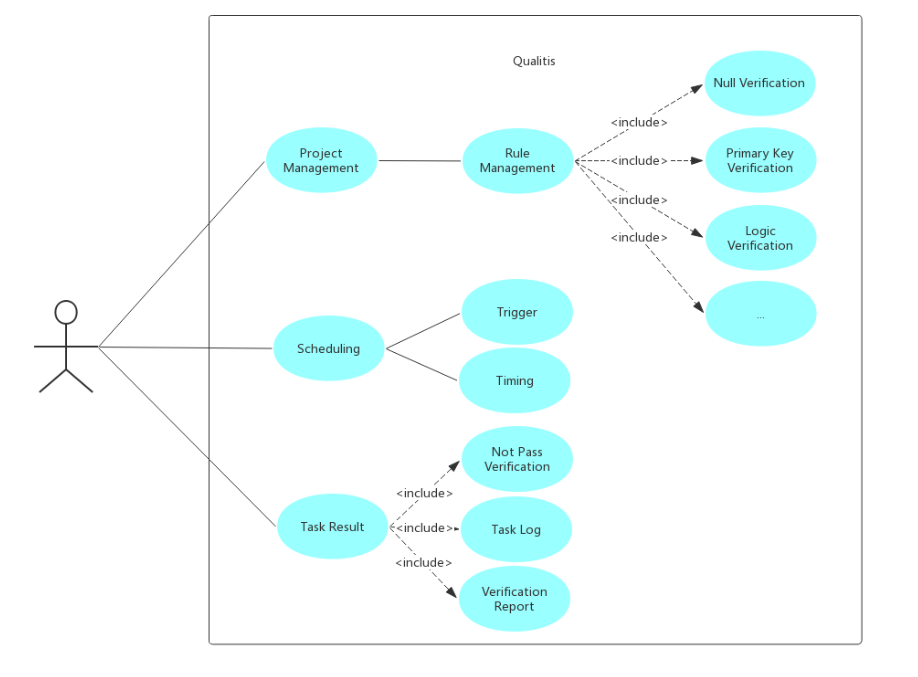

# Architecture Design

## 1. Overview
#### 1.1 Background  
Data quality is an important part of big data processing, and it is an essential support condition for data services, data analysis, data mining and other activities.

#### 1.2 System Summary
Qualitis is a data quality management service based on big data platform, providing a unified process to define and monitor the quality of data.

#### 1.3 Glossary
|Terminology |Description|
|--|--|
|project|   A project is a collection of rules. And the project is also one of the units for task scheduling.|
|rule|  A rule is a definition of a data source's data quality model. Rule is the base unit for task scheduling.|
|application|   Application is a verification task of data quality. You can verify data quality by running an application.|

## 2. Overall Design
#### 2.1 Architecture Design

#### 2.2 Grayscale Design
Since each Qualitis Service is idempotent, we need to isolate the Qualitis service from accepting user requests to implement it.  

#### 2.3 High availability/Performance Design
Since each Qualitis Service is idempotent, Qualitis HA can be reach by simultaneously starting multiple Qualitis services.As shown below：  
  
This strategy not only achieves HA, but also achieves performance improvements.

For performance design, the following option is also considered. But it has not been implemented yet.

1.Cache  
Using distributed cache to cache the query results, you don't have to query the database every time, greatly reducing the pressure on the database and improving the speed of the query.

#### 2.4 Multi-threaded Synchronous Design
##### 1.Process Synchronization
Because there are multiple Qualitis instances, problems occurred when the status of the applications be refreshed at the same time. Therefore, the problem of process synchronization needs to be solved.  

The Qualitis system uses ZooKeeper to coordinate multiple processes. Qualitis instances will compete for the establishment of temporary nodes in Zookeeper. Once a temporary node is established successfully, the instance will become the monitor instance. Only monitor instance can monitor the application and refresh the status of the applications.

##### 2.Thread Limit

When an appliacation is submitted, it is necessary to connect to the hive meta store to determine whether the database that stores the unverified data exists or not.

When there are more and more applications are submitted, it may cause a great load on the hive meta store, so we need to limit it.

Qualitis system uses thread pool to limit the connection to hive meta store. If there are no available thread in thread pool, the application will wait until the thread is obtained before connecting to the hive meta store.

## 3. Module Design
#### 3.1 Use Case

## 4. Interface Design
#### 4.1 Internal interface
Internal interfaces are mainly divided into two types of interfaces:  
**1.Administrator interface  
2.User interface**

Administrator interface: /qualitis/api/v1/admin/\*  
User interface: /qualitis/api/v1/projector/\*  
Distinguish user rights through two different interface definitions.

#### 4.2 Outer Interface
Outer interface:/qualitis/outer/api/v1/\*  
Such interface calls need to add the following parameters to the query:  

|Parameter |Required | Type | Description|
| -- | -- |-- |-- |
|app_id  |yes |  string  |Authorized application APP_ID assigned by the system.|
|timestamp  | yes  | string | Timestamp in milliseconds, timeliness: 7 days.|
|nonce |  yes | string | Random number, length 5|
|signature |  yes  | string |  Encrypt the signature. Md5(md5(appId + nonce + timestamp) + appToken), where md5 in 32 lengths, lowercase|

Administrator will grant grant app_id and appToken external system.

 
## 5. System Engineering Structure Design
The engineering structure of the system can be divided into two layers, the Web layer and the Core layer.

The Web layer mainly includes Controllers and a Services, and mainly includes service layers that provide services externally. The Core layer mainly includes core logic codes and a storage layer.
