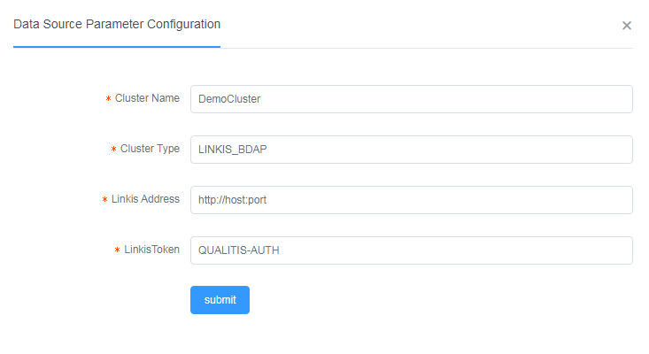

# How to get Linkis Token

## Linkis Configuration
### Add Linkis Token
```
cd $LINKIS_HOME/linkis-gateway/conf
vim token.properties
```

Add line as follow:
```
QUALITIS-AUTH=*
```

### Modify Linkis Default Queue of User
1. Login in DataSphere Studio using the user same as qualitis.

2. Enter 'Linkis Console' -> Settings -> wds.linkis.yarnqueue, and then set a queue in yarn.

### Add Lib of MySQL
```
cd $LINKIS_HOME/linkis-ujes-spark-enginemanager/lib
```
Add MySQL Lib in it.

At last, restart Linkis.

## Qualitis Configuration
Type in 'QUALITIS-AUTH' in the blank of Linkis Token:  
Here is an example：  
