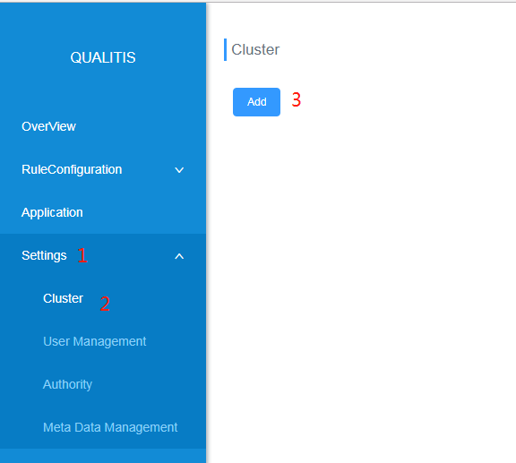

# Quick Deploy

## 1. Basic Software Installation
Gradle (4.6)
MySQL (5.5+)
JDK (1.8.0_141)
Linkis (1.0.0+), Spark engine required.[How to install Linkis?](https://github.com/WeBankFinTech/Linkis)  
DataSphereStudio (1.0.0+) Optional. If you want to use workflow, it it required. [How to install DataSphereStudio?](https://github.com/WeBankFinTech/DataSphereStudio)  

## 2. Download
[Download](https://github.com/WeBankFinTech/Qualitis/releases)

## 3、Compile(break this step if using binary installation)
```
gradle clean distZip
```

## Installation
### 4.1 Unzip installation package
##### zip
```
unzip qualitis-{version}.zip
```

##### tar
```
tar -zxvf qualitis-{VERSION}.tar.gz
```

### 4.2 Connect to MySQL and initialize data
```
mysql -u {USERNAME} -p {PASSWORD} -h {IP} --default-character-set=utf8
source conf/database/init.sql
```

### 4.3 Modify configuration
```
vim conf/application-dev.yml
```
Modify the configuration below:
```
spring:
  # Datasource, support active and standby connections master,worker, no master or backup can be configured with the same content
  datasource:
    master:
      username: [DB_USERNAME]
      password: [DB_PASSWORD]
      private_key: X
      url: jdbc:mysql://[DB_HOST_MASTER]:[DB_PORT]/[DB_NAME]?createDatabaseIfNotExist=true&useUnicode=true&characterEncoding=utf-8
      driver-class-name: com.mysql.jdbc.Driver
      type: com.zaxxer.hikari.HikariDataSource
    worker:
      username: [DB_USERNAME]
      password: [DB_PASSWORD]
      private_key: X
      url: jdbc:mysql://[DB_HOST_WORKER]:[DB_PORT]/[DB_NAME]?createDatabaseIfNotExist=true&useUnicode=true&characterEncoding=utf-8
      driver-class-name: com.mysql.jdbc.Driver
      type: com.zaxxer.hikari.HikariDataSourc
 
## The configuration required for the rule parsing spark sql task, the database information is consistent with the above
task:
  persistent:
    type: jdbc
    username: [DB_USERNAME]
    password: [DB_PASSWORD]
    private_key: X
    # Must be a main library that supports writing
    address: jdbc:mysql://[DB_HOST_MASTER]:[DB_PORT]/[DB_NAME]?createDatabaseIfNotExist=true&useUnicode=true&characterEncoding=utf-8
```

### 4.4 Start Service
```
dos2unix bin/*
sh bin/start.sh
```

## 5. Login
### 5.1 Login
Open the browser and type in "localhost:8090"  
  
Type in the user name and password below:

### 5.2 Configuration
Click on "Configuration" -> "Cluster Configuration" to add cluster.  
  
Type in the configuration information below:    
Cluster name(The name of Hadoop cluster)  
Cluster type
Linkis address  
Linkis Token(How to get Linkis Token：[Linkis Access Guide](Linkis Access Guide.md))  

Here is an example:  


---

Workflow is default supported.   
You need to install [DataSphereStudio](https://github.com/WeBankFinTech/DataSphereStudio) to use workflow.  
Enabling workflow does not affect the normal use of Qualitis.  
If you want to close it, you can do as follow:
```
vim conf/application.yml
```
And set workflow.enable=false

---

Debug mode is default opened, and the default port is 8091.  
If you want to close it, you can delete the following code in 'build.gradle' when you are using source code.
```
-agentlib:jdwp=transport=dt_socket,server=y,suspend=n,address=8091
```
or you can edit the 'bin/qualitis' file when you are in binary code.