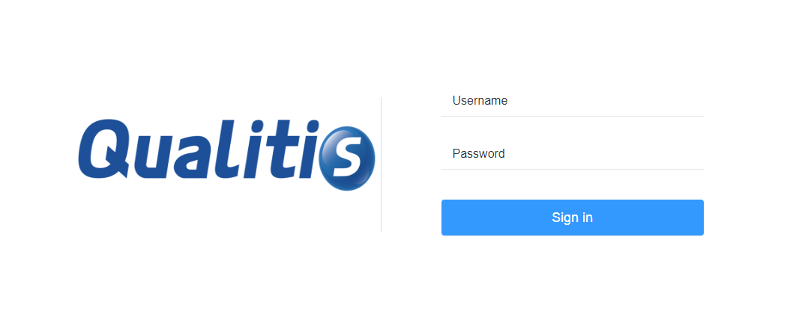
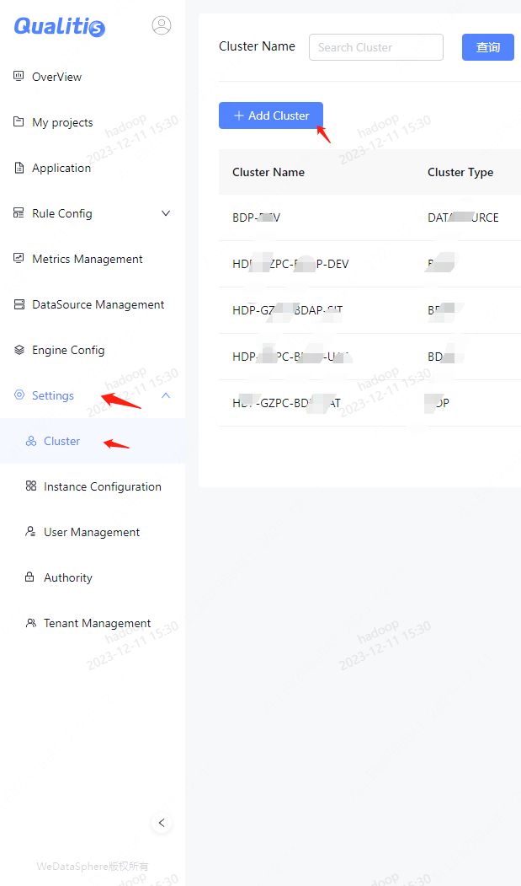
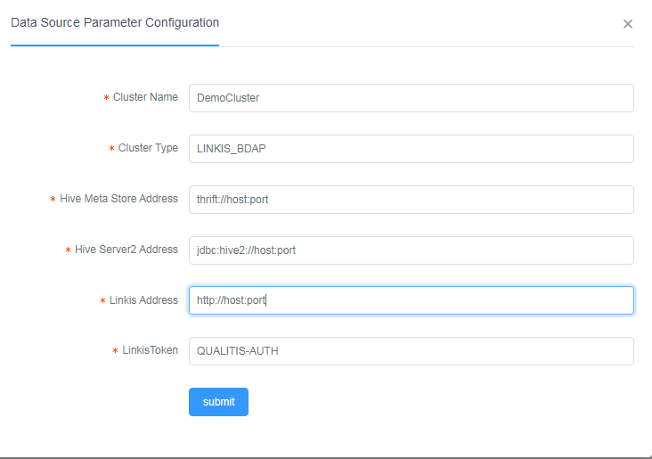
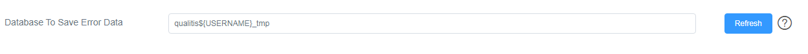

# Quick Deploy

## 1. Basic Software Installation
Gradle (4.9)  
MySQL (5.5+)  
JDK (1.8.0_141)  
Hadoop (2.7.2)  
Hive (1.2.1)   
Zookeeper (3.4.9)  
Linkis (0.9.1), Spark engine required.[How to install Linkis?](https://github.com/WeBankFinTech/Linkis)  
DataSphereStudio (0.6.0) Optional. If you want to use workflow, it it required. [How to install DataSphereStudio?](https://github.com/WeBankFinTech/DataSphereStudio)

## 2. Download
[Download](https://github.com/WeBankFinTech/Qualitis/releases)

## 3、Compile(break this step if using binary installation)
```
gradle clean distZip
```

## Installation
### 4.1 Unzip installation package
##### zip
```
unzip qualitis-{version}.zip
```

##### tar
```
tar -zxvf qualitis-{VERSION}.tar.gz
```

### 4.2 Connect to MySQL and initialize data
```
mysql -u {USERNAME} -p {PASSWORD} -h {IP} --default-character-set=utf8
source conf/database/init.sql
```

### 4.3 Modify configuration
```
vim conf/application-dev.yml
```
Modify the configuration below:
```
## database configuration
spring.datasource.username=
spring.datasource.password=
spring.datasource.url=

## database configuration, the same as above 
task.persistence.username=
task.persistence.password=
task.persistence.address=

## zookeeper address
zk.address=
```

### 4.4 Start Service
```
dos2unix bin/*
sh bin/start.sh
```

## 5. Login
### 5.1 Login
Open the browser and type in "localhost:8090"  
  
Type in the user name and password below:  
username: "admin"  
password: "admin"  

### 5.2 Configuration
Click on "Configuration" -> "Cluster Configuration" to add cluster.  
  
Type in the configuration information below:    
Cluster name(The name of Hadoop cluster)  
Cluster type
Linkis address  
Linkis Token(How to get Linkis Token：[Linkis Access Guide](Linkis Access Guide.md))  

Here is an example:  


---

Tips:

Qualitis will save the abnormal data in the database. The saved database name can be configured in the system settings, as shown in the following figure:

As shown in the figure, Qualitis provides $ {USERNAME} as an expression for user name replacement. The abnormal data ran by different users are stored in their respective databases.

---

Workflow is default supported.   
You need to install [DataSphereStudio](https://github.com/WeBankFinTech/DataSphereStudio) to use workflow.  
Enabling workflow does not affect the normal use of Qualitis.  
If you want to close it, you can do as follow:
```
vim conf/application.yml
```
And set workflow.enable=false

---

Debug mode is default opened, and the default port is 8091.  
If you want to close it, you can delete the following code in 'build.gradle' when you are using source code.
```
-agentlib:jdwp=transport=dt_socket,server=y,suspend=n,address=8091
```
or you can edit the 'bin/qualitis' file when you are in binary code.