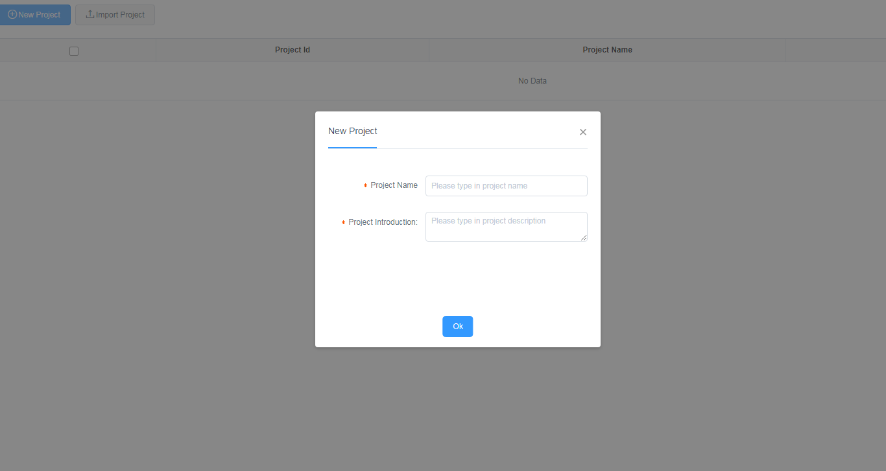
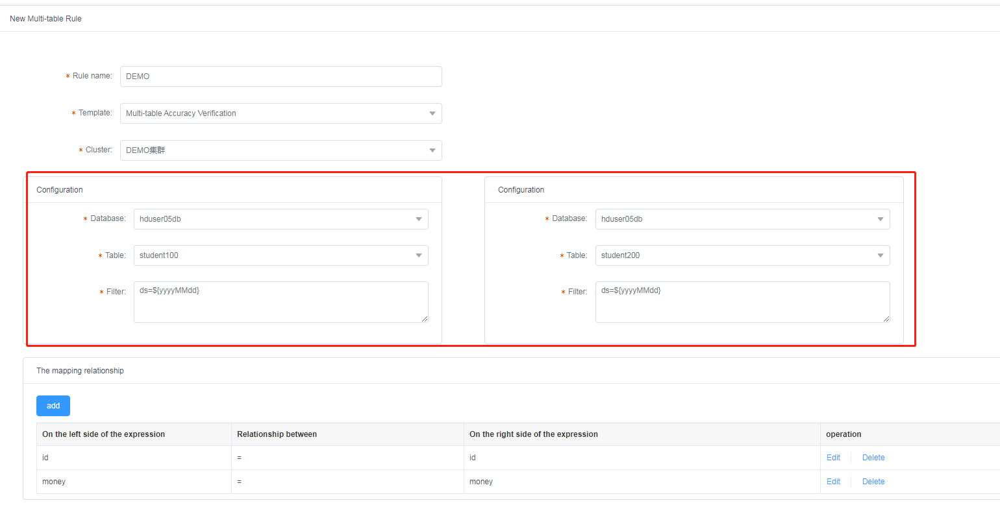

# User Manual

## 1. Introduction
Qualitis is a one-stop data quality management platform that supports quality verification, notification, and management for various datasource. It is used to solve various data quality problems caused by data processing.

Based on Spring Boot, Qualitis analysis quality model by [Linkis](https://github.com/apache/incubator-linkis). It provides functions such as data quality model construction, timing execution, trigger execution, data quality verification, reports of data quality generation and so on.

At the same time, Qualitis provides enterprise-level features of financial-level resource isolation, management, access control and collaborative edition. It is also guaranteed working well under high-concurrency, high-performance and high-availability scenarios.

## 2. Login
   
Type in username and password.

## 3. Create Project
After login, click on the "Rule Configuration" button on the left menu.    
In the secondary menu below, click on "Project" button to enter the project module.    
   
Then, click on the "New Project" button on the upper left corner, and you will enter the "New Project Page".  
     

Enter the information below  
##### 1) Project Name
The name of project, unique.  
##### 2) Project Introduction

You can create a new project by clicking "ok".

## 4、Create Rule
After creating project, you should then create rules. The buttons in the lower left corner, can create single table rules, custom rules and multi-table rules.     

### 4.1 Single Table Rule Demo    
    
First, you can click on "New Single Table Rule" button to create a new rule.  
Then, type in the information below:    
##### 1) Rule Name  
The name of rule.
##### 2) Template
Qualitis System provides various template to simplify rule configuration.  
Select the template you want to verify.  
##### 3) Configuration
Here you can select the data source you want to verify. When you select the data source, it will replace the placeholder in the SQL below.  
Tips:  
You can type in the "system expression" in input box of "Filter". When executing task, it will be replaced by the actual date.

Now we provide the following system expressions:  

|Expression|Execute Time|Replace Value|
| ------------ | ------------ | -- |
|${yyyyMMdd}[-N(Option)]|Dec 17 18:00:00 2018|20181217(N day before)|
|${yyyy-MM-dd}[-N(Option)]|Dec 17 18:00:00 2018|2018-12-17(N day before)|
|${yyyyMMddHH}[-N(Option)]|Dec 17 18:00:00 2018|2018121715(N day before) only minus by day|
|${yyyy/MM/dd}[-N(Option)]|Dec 17 18:00:00 2018|2018/12/17(N day before)|

##### 4) Verification
If not checked, Qualitis will not monitor the application result, which means that Qualitis don't know if the result is pass of not.

If checked, you should select the result to monitor and set the threshold to make the verification failed.
When the result exceed the threshold, the status of this application will become "Not Pass".

Qualitis system provides the following four methods to compare between result and threshold.  
We assume the threshold you set is 'x' and the result of this application is 'r'.  

<b>1.Monthly Fluctuation：Compare this application result with the average value of this rule this month, the application will pass the verification if and only if the expression become true: (1-x)\*y<=r<=(1+x)\*y, and failed if false.  
2.Weekly Fluctuation：The same as the Monthly Fluctuations, the value to compare is the average value of this week.  
3.Daily Fluctuation：The same as the Monthly Fluctuations, the value to compare is the average value of this day.  
4.Fixed Value：Compare this application result with the fixed value. You can choose "Equal", "Greater than" and other compare method to compare. The application will failed when x = r if the compare type you choose is "Equal". 
</b>

     

As shown in the picture above, it is a rule of null value verification.  
When the result of application is 0, the status of application will become "Not Pass".  

### 4.2 Custom Rule Demo
  
Click on the button of "New Custom Rule" to create custom rules.      
Type in the following information below:    
##### 1)Rule Name  
The name of rule.  
##### 2)Check Column
The alias name to check  
##### 3)Function
Select function of SQL  
##### 4)Cluster
The cluster to submit applications
##### 5)Save results that do not conform to data validation
If checked, it will take the data that not pass verification out and save it.Otherwise, it will not be saved.

The SQL to execute will be shown below.

### 4.3 Multi-table Rule Demo
  
Click on the button of "New Multi-table Rule" to create multi-table rules.     

You can select two tables in the same cluster in multi-table rule to compare the differences between them.  

Now Qualitis provides two template below:
- Accuracy Verification
Accuracy verification can compare the differences in the two table selected.
- Common Verification
You can define custom verification SQL by using common verification template.

Here is an example of accuracy verification:  

Compose there is a table A, and a table B. The data in table is shown below:  
 
Table A

|ColumnA1|ColumnA2|
| ------------ | ------------ |
|a|1|
|b|2|
 
Table B

|ColumnB1|ColumnB2|
| ------------ | ------------ |
|a|1|
|b|3|
 
If you compare the data between column columnA1 and columnB1, then they are the same.
If you compare the data between column columnA1 and columnB1, and also compare the data between column ColumnA2 and ColumnB2, then there is a different record.

Here is the step:    
**1.Type in basic information**   

**2.Select the table to compare**  

**3.Select the column to compare**  

## 5、Run Application
Application can be run in two way, in the way of project or rule.

In the way of project to run the application, it will collect all the rules in the project. Here is an example.  
    

And you can also run application in the way of rule. As the picture given below:
  

## 6、Application
Click on the "Application" button in the left menu to enter the application page.  

You can look up the application in this page, and click on one application to view the detail of application.  

And you can also click on the status of application to get the verification result of application.  
  