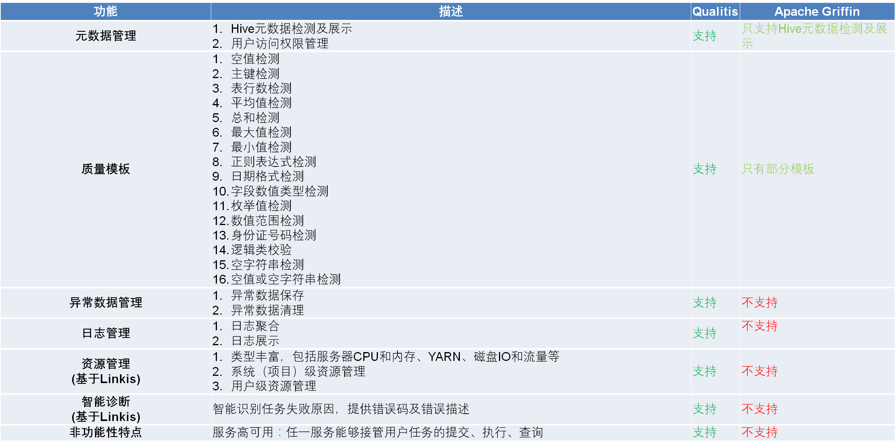

  

[English](../../../) | 中文  

## 引言
Qualitis是一个支持多种异构数据源的质量校验、通知、管理服务的数据质量管理平台，用于解决业务系统运行、数据中心建设及数据治理过程中的各种数据质量问题。

Qualitis基于Spring Boot，依赖于Linkis进行数据计算，提供数据质量模型构建，数据质量模型执行，数据质量任务管理，异常数据发现保存以及数据质量报表生成等功能。并提供了金融级数据质量模型资源隔离，资源管控，权限隔离等企业特性，具备高并发，高性能，高可用的大数据质量管理能力。

## 核心特点
- **数据质量模型定义**   
支持以下数据模型定义：  
1.单表校验数据模型。  
2.跨表校验数据模型。  
3.自定义校验数据模型。  
 同时，系统预置了多个数据质量校验模版，包括空值校验，枚举校验等常用校验，并且支持自定义数据质量模版。  

- **数据质量模型调度**  
支持数据质量模型调度。 

- **数据质量报表**  
支持生成数据质量报表  

- **日志管理**
日志聚合管理，方便排查数据质量任务

- **异常数据管理**
支持异常数据提取和存储，快速定位问题

- **支持工作流**
支持在工作流当中进行数据质量校验  
工作流必装[DataSphereStudio](https://github.com/WeBankFinTech/Linkis).

- **管理员控制台**  
提供管理员控制台界面，支持人员管理，权限管理，权限管理，元数据管理等管理功能。  

## 与类似系统对比

## 文档列表
[快速搭建手册](快速搭建手册.md)  
[用户手册](用户手册.md)  
[架构设计文档](架构设计文档.md)  
 

## Architecture

## Road Map
### 1. 支持对报表数据进行数据质量校验

- 支持在工作流当中，对生成的报表数据进行数据质量校验  

### 2. 支持多种数据源的数据质量校验

- 支持HDFS, HIVE, MySQL等数据源间的数据质量校验  
- 支持实时数据的数据质量校验，如Kafka  

### 3. 支持生成可选纬度的数据质量报表

- 支持可选纬度生成数据质量报表

### 4. 支持智能发现数据质量问题
 

**如果您有任何需求，欢迎给我们提issue，我们将会及时给您回复。**

## Contributing
非常欢迎广大的社区伙伴给我们贡献新引擎和代码！

## Communication
如果您想得到最快的响应，请给我们提issue，或者您也可以扫码进群：  

## License
**Linkis is under the Apache 2.0 license. See the [LICENSE](/LICENSE) file for details.**

## Tips
由于Qualitis的前端代码是采用WeBank自研的前端框架FES，但是FES框架目前没有开源，所以Qualitis的前端代码暂不开源。我们会尽快推进Qualitis的前端开源。对此我们感到非常抱歉。

你可以通过源码下载，并解压web/app/src/main/resources/static/static.zip来获取编译后的前端代码，或者通过下载release直接使用。