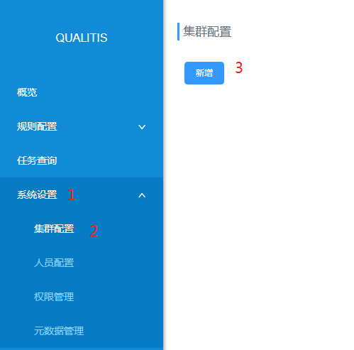
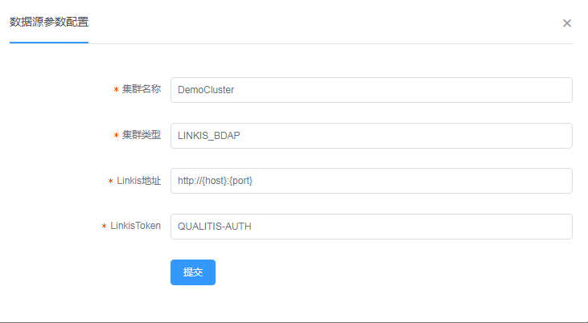

# 快速搭建手册

## 一、基础软件安装
Gradle (4.6)  
MySQL (5.5+)  
JDK (1.8.0_141)
Linkis（1.0.0+), 必装Spark引擎。[如何安装Linkis](https://github.com/WeBankFinTech/Linkis)  
DataSphereStudio (1.0.0+) 可选. 如果你想使用工作流，必装DataSphereStudio [如何安装DataSphereStudio?](https://github.com/WeBankFinTech/DataSphereStudio)

## 二、安装包下载
[下载](https://github.com/WeBankFinTech/Qualitis/releases)

## 三、编译(二进制包跳过)
```
gradle clean distZip
```

## 四、部署
### 4.1 解压安装包
##### zip包
```
unzip qualitis-{version}.zip
```

##### tar包
```
tar -zxvf qualitis-{VERSION}.tar.gz
```

### 4.2 连接MySQL，插入初始数据。
```
mysql -u {USERNAME} -p {PASSWORD} -h {IP} --default-character-set=utf8
source conf/database/init.sql
```

### 4.3 修改配置文件
```
vim conf/application-dev.yml
```
修改以下配置：
```
## 数据库配置
spring:
  # datasource，支持主备连接配置 master,worker，无主备可配置成一样的内容
  datasource:
    master:
      username: [DB_USERNAME]
      password: [DB_PASSWORD]
      private_key: X
      url: jdbc:mysql://[DB_HOST_MASTER]:[DB_PORT]/[DB_NAME]?createDatabaseIfNotExist=true&useUnicode=true&characterEncoding=utf-8
      driver-class-name: com.mysql.jdbc.Driver
      type: com.zaxxer.hikari.HikariDataSource
    worker:
      username: [DB_USERNAME]
      password: [DB_PASSWORD]
      private_key: X
      url: jdbc:mysql://[DB_HOST_WORKER]:[DB_PORT]/[DB_NAME]?createDatabaseIfNotExist=true&useUnicode=true&characterEncoding=utf-8
      driver-class-name: com.mysql.jdbc.Driver
      type: com.zaxxer.hikari.HikariDataSourc
 
## 规则解析 spark sql 任务所需配置，数据库信息和以上一致
task:
  persistent:
    type: jdbc
    username: [DB_USERNAME]
    password: [DB_PASSWORD]
    private_key: X
    # 必须是支持写入的主库
    address: jdbc:mysql://[DB_HOST_MASTER]:[DB_PORT]/[DB_NAME]?createDatabaseIfNotExist=true&useUnicode=true&characterEncoding=utf-8
```

### 4.4 启动系统
```
dos2unix bin/*
sh bin/start.sh
```

## 五、登录
### 5.1 登录验证
浏览器中输入localhost:8090, 出现一下页面说明启动成功  
  
输入  
用户名: admin  
密码: admin  

### 5.2 系统配置填写
点击系统配置 -> 参数配置，并新增集群
  
填入以下配置信息：  
集群名称(Hadoop集群名称)  
集群类型
Linkis地址  
Linkis Token(Linkis Token配置方式请查看文档：[接入Linkis文档](接入Linkis文档.md))  

可参考以下例子：


---

工作流已默认开启，工作流需要安装[DataSphereStudio](https://github.com/WeBankFinTech/DataSphereStudio)。  
开启工作流不影响Qualitis正常使用。
如需关闭，可修改配置文件
```
vim conf/application.yml
```
并修改workflow.enable=false

---

Debug模式已默认开启，默认端口是8091。
在源码中，你可以通过在'build.gradle'文件中删除以下代码，关闭Debug模式。
```
-agentlib:jdwp=transport=dt_socket,server=y,suspend=n,address=8091
```
如果是在编译好的代码中，可以通过编辑'bin/qualitis'文件，来关闭Debug模式。