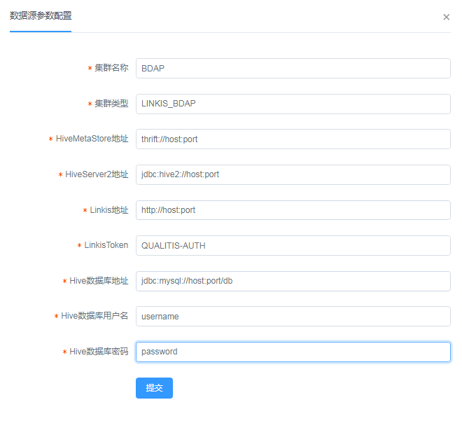

# 接入Linkis文档

## Linkis配置
### 增加Linkis Token
```
cd $LINKIS_HOME/linkis-gateway/conf
vim token.properties
```

增加以下行：
```
QUALITIS-AUTH=*
```

### 修改用户默认提交队列
1. 在DataSphere Studio中登录Qualitis同名的用户名

2. 进入Linkis管理台 -> 设置 -> yarn队列名中，并设置一个可用的yarn队列

### 加入MySQL依赖包
```
cd $SPARK_HOME/jars
```
并加入mysql依赖包

最后，重启Linkis

## Qualitis配置
在Linkis Token中填入'QUALITIS-AUTH'  
如下图所示：  
