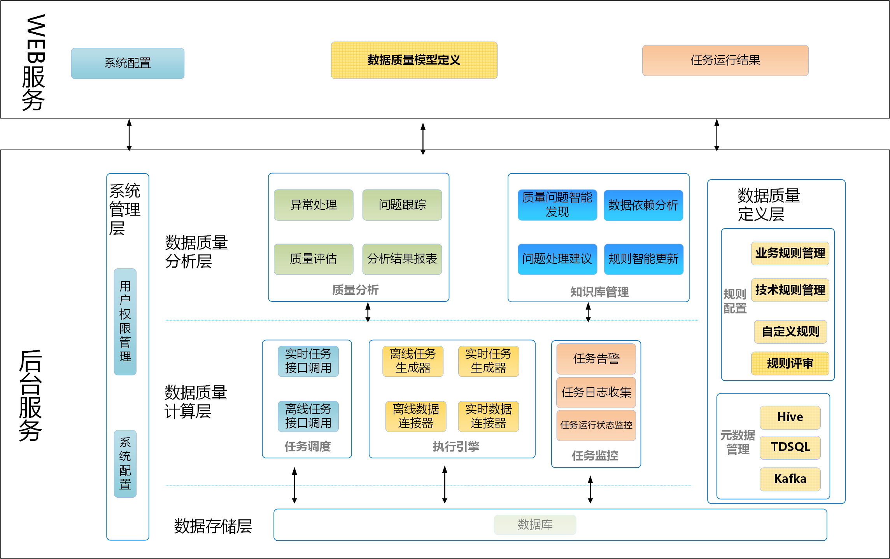
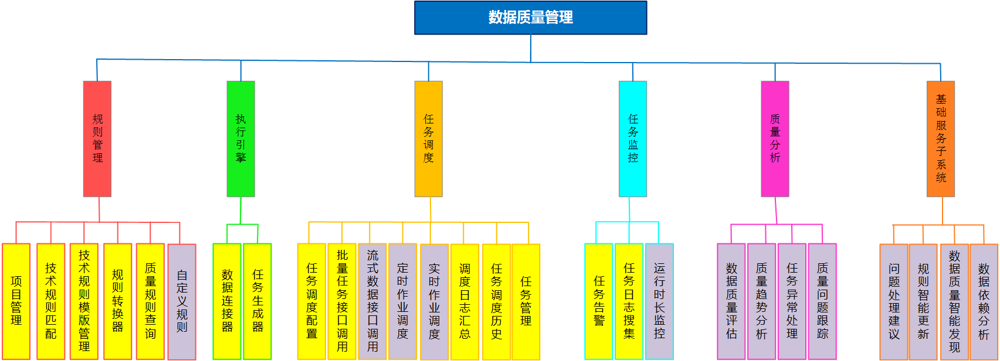

# 架构设计文档

## 一、引言
#### 1.1 项目背景
数据质量监测是大数据处理中最重要的一个环节，是数据服务、数据分析、数据挖掘等活动的必备支持条件。

#### 1.2 项目概述
提出了一个基于大数据平台的数据质量管理服务Qualitis，提供统一的流程来定义和检测数据集的质量并及时报告问题。

#### 1.3 术语表

|术语 |含义 |
|--|--|
|项目(project)|   一系列规则的集合，决定告警人和告警级别，是任务调度的单位之一。|
|规则(rule)|  数据源的数据质量模型的定义，决定是否告警，是任务调度的基础单位。|
|任务(application)|   数据质量检测任务，通过运行数据质量任务，可以查看数据质量校验结果。|

## 二、总体设计
#### 2.1 总体架构设计

#### 2.2 灰度功能设计
由于每个Qualitis后端服务是幂等的，要灰度只需要对单个后端服务进行隔离，让其无法接受用户请求。  

#### 2.3 高可用及性能设计
Qualitis各个服务之间是幂等的，可以通过同时起多个Qualitis服务，对Qualitis服务进行负载均衡进行实现。如下图所示：
  
负载均衡这一策略，不仅实现了高可用，并且也实现了性能的提升。

性能方面的设计，考虑以下方案。但目前暂未实现。

1.查询缓存  
使用分布式缓存，将查询结果缓存起来，就不必查询的时候，每次都查询数据库，大大的减少了数据库的压力，并且提升了查询的速度。

#### 2.4 多线程同步设计
##### 1.进程同步
由于存在多个Qualitis实例，多个实例之间可能会存在同时刷新监控任务状态的情况，所以需要解决进程同步的问题。

Qualitis系统采用Zookeeper协调多进程，多个Qualitis实例会争抢在Zookeeper中建立临时节点，建立临时节点成功的，会作为Monitor角色，由Monitor角色对监控任务，并刷新任务的状态。

##### 2.线程限流
当触发监控任务提交时，需要连接hive meta store，判断保存未通过校验的数据的数据库是否存在。

当提交任务量上来是，可能会对hive meta store造成巨大压力，所以需要对任务提交进行限流。

Qualitis系统使用线程池的方式，对连接hive meta store进行限流，如果从线程池中拿不到线程，任务会等待，直到拿到线程，才连接hive meta store。

## 三、  模块设计
#### 3.1 总体模块设计图

#### 3.2 用例图

## 四、  接口设计
#### 4.1 内部接口
内部接口主要分为两类接口：  
**1.管理员接口  
2.用户接口**

管理员接口设计: /qualitis/api/v1/admin/\*  
用户接口设计: /qualitis/api/v1/projector/\*  
通过两种不同的接口定义方式，将用户的权限区分开。  

#### 4.2 外部接口
外部接口url定义:/qualitis/outer/api/v1/\*  
此类接口调用需要在query中增加如下参数:  

|参数名 |必选 | 类型 | 说明|
| -- | -- |-- |-- |
|app_id  |是 |  string  |系统分配的授权应用APP_ID.|
|timestamp  | 是  | string | 时间戳。毫秒级的时间戳，时效性：7天|
|nonce |  是  | string | 随机数，长度为5|
|signature |  是  | string | 加密签名。md5(md5(appId + nonce + timestamp) + appToken)，其中md5生成32长度，小写|

其中app_id和appToken需要管理员授予外部系统。

 
## 五、系统工程结构设计
系统的工程结构可以分为2层，Web层和Core层。

Web层主要包括Controller和Service，主要包含对外提供服务的服务层，Core层主要包括核心代码逻辑和存储层。
