# 用户手册

## 一、产品介绍
Qualitis是一个数据质量管理系统，用于监控数据质量。其功能包括数据质量模型定义，数据质量结果可视化、可监控。数据质量管理服务提供一整套统一的流程来定义和检测数据集的质量并及时报告问题。

## 二、登录
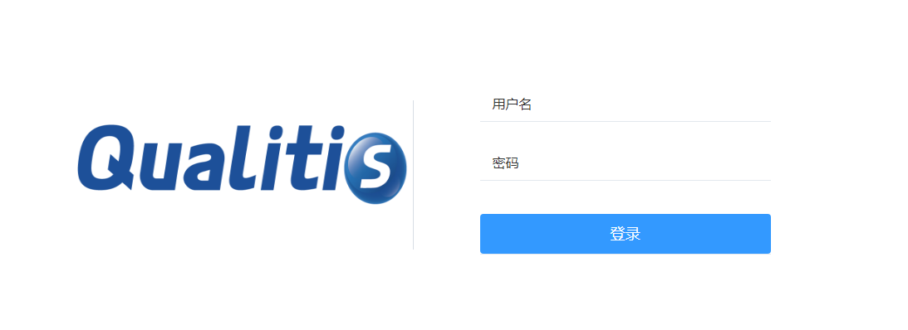  
输入用户名密码

## 三、创建项目
登录成功之后，点击左侧栏的规则配置。在其下的二级菜单中，点击我的项目，进入项目模块。  
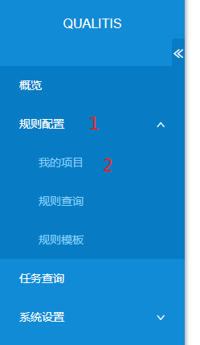  
点击页面左上方的新增项目，弹出新增项目界面。  
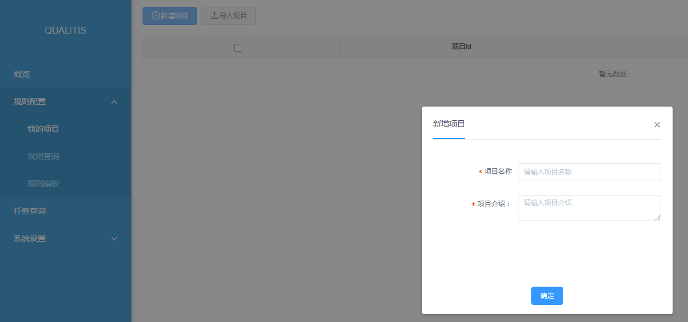    
填入  
##### 1)项目名称
项目的名称，不能重复。  
##### 2)项目介绍
对该项目的简单介绍。  
点击保存，即可创建一个新项目。

## 四、创建规则
保存项目之后，左下角可以创建规则。可以新建单表规则，自定义规则以及跨表规则。  

### 4.1 单表规则创建示例    
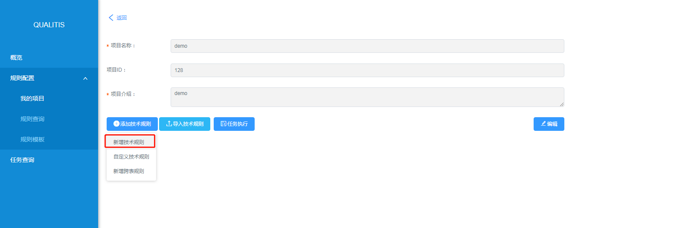    
点击新增技术规则，进入新增单表技术规则页面。  
填入  
##### 1)规则名称    
技术规则的名称，不可重复。
##### 2)校验规则
系统的校验模版，选择不同的校验模版，可以进行不同的校验。
##### 3)配置
选择模版中真正校验的数据源，选择数据源，会替换掉校验模版中的占位符，真正执行的SQL语句可以在SQL预览中查看。其中过滤条件可以填写系统提供的表达式，该表达式会在任务真正执行的时候，替换成实际的日期时间进行执行。

提供的表达式如下：

|表达式|当天日期|替换值|
| ------------ | ------------ | -- |
|${yyyyMMdd}[-N(可选)]|2018年12月17号|20181217(前N天)|
|${yyyy-MM-dd}[-N(可选)]|2018年12月17号|2018-12-17(前N天)|
|${yyyyMMddHH}[-N(可选)]|2018年12月17号15点|2018121715(前N天)只减天数|
|${yyyy/MM/dd}[-N(可选)]|2018年12月17号|2018/12/17(前N天)|

##### 4)是否告警
如果不进行告警，不会监控任务的输出结果。

如果选择告警，并在其中选择监控的输出结果，并设定监控的阈值，当结果超出告警阈值的时候，任务就是不通过校验的状态。

比较运行结果和阈值的方式有以下四种：(假设设定的阈值为x，本次任务的运行结果为r)

**1.月波动：将任务的运行结果和本条技术规则本月的运行结果的平均值y进行比较，如果(1-x)\*y<=r<=(1+x)\*y，任务通过校验，否则任务不通过校验。  
2.周波动：和月波动同理，计算的平均值是本周的平均值。  
3.日波动：和月波动周波动同理，计算的平均值是本日的平均值。  
4.固定值：和一个固定值进行比较，比较的方式有等于，大于等等，如果比较选择比较方式是等于，那么如果r=x，那么任务不通过校验。**

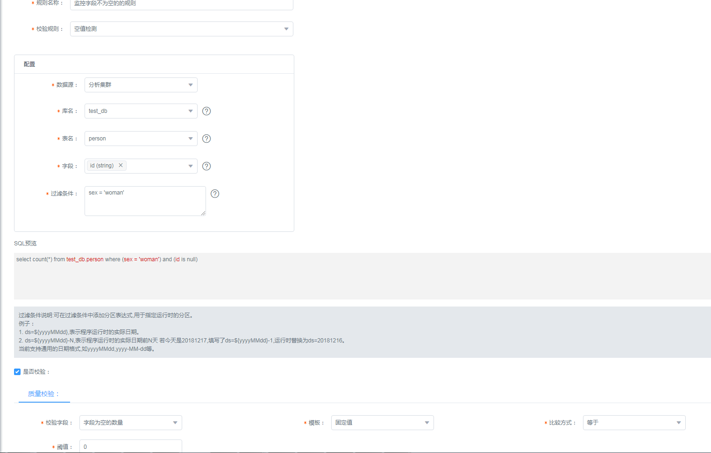     

如上图所示，上图创建了一个监控字段不为空的的技术规则。在SQL预览中可以看到实际执行的SQL语句。
质量校验那里，会监控字段为空的数目，如果字段为空的数目不为0，那么会不通过校验。

### 4.2 自定义规则创建示例
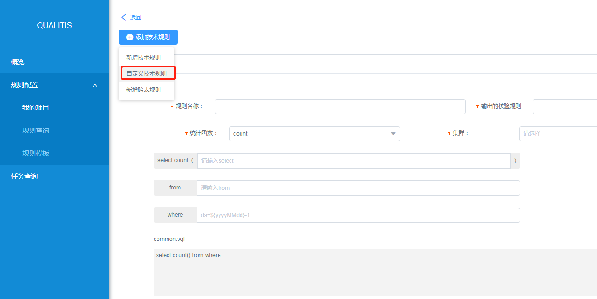  
点击新增自定义技术规则，进入新增自定义技术规则页面。    
填入  
##### 1)规则名称  
技术规则的名称，不可重复。  
##### 2)输出的校验规则
校验的列的别名  
##### 3)统计函数
自定义SQL的统计函数  
##### 4)集群
选择提交任务的集群
##### 5)保存不符合数据校验的结果
如果勾选，则会将没通过校验的数据提取出来并保存，否则不会保存

将要执行的SQL语句会在预览中显示。

### 4.3 跨表规则创建示例
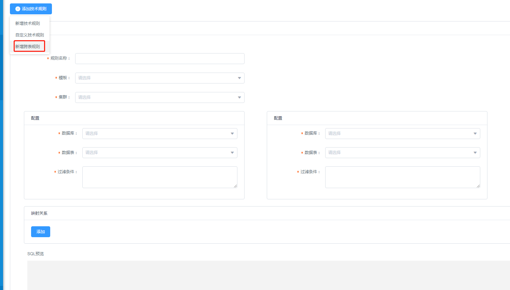  
点击新增跨表技术规则，进入新增跨表技术规则页面。  

跨表技术规则能选择同一个集群中两张表，并对两张表进行数据校验。

跨表技术规则目前提供以下两种模版：
- 准确性校验
准确性校验可以比较两个表之间，所选字段的数据记录的准确性差异性。
- 通用校验
通过通用校验模版，可自定义跨表校验SQL。

以准确性校验为例子:  
有表A和表B，数据分别如下：
 
A表

|ColumnA1|ColumnA2|
| ------------ | ------------ |
|a|1|
|b|2|
 
B表

|ColumnB1|ColumnB2|
| ------------ | ------------ |
|a|1|
|b|3|
 
如果对比ColumnA1和ColumnB1中的数据，则表A和表B完全一致。  
如果对比ColumnA1和ColumnB1，以及ColumnA2和ColumnB2中的数据，则表A和表B中的数据有一条不一致。

配置方法如下所示：  
**1.填写信息**   

**2.选择需要比对的两张表**  

**3.选择比对的字段**  

## 五、任务执行
任务可以从两个纬度执行，项目纬度和规则纬度。

项目纬度进行任务执行，会将项目下所有规则都提交执行。执行方式如下图所示：  
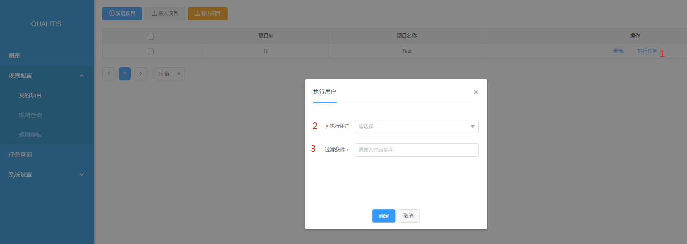    

规则纬度则是挑选规则进行任务执行。执行方式如下图所示：  
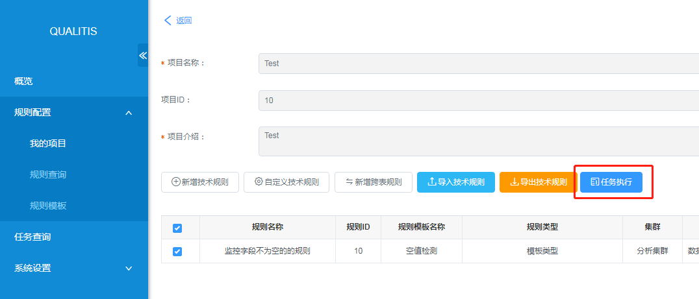  

## 六、任务查看
点击左侧菜单栏中任务查询，即可进入任务界面。

提交的任务可以在任务界面中查找到，点击某一任务即可进入任务详情界面。
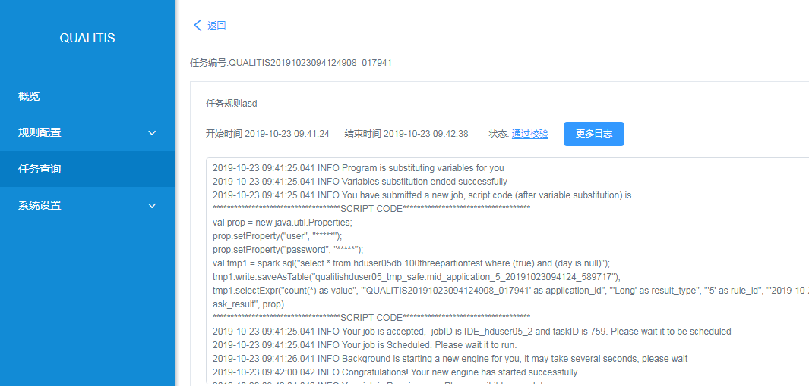

任务的校验结果可以点击任务的状态进行查看。
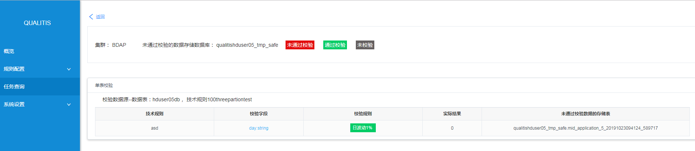  