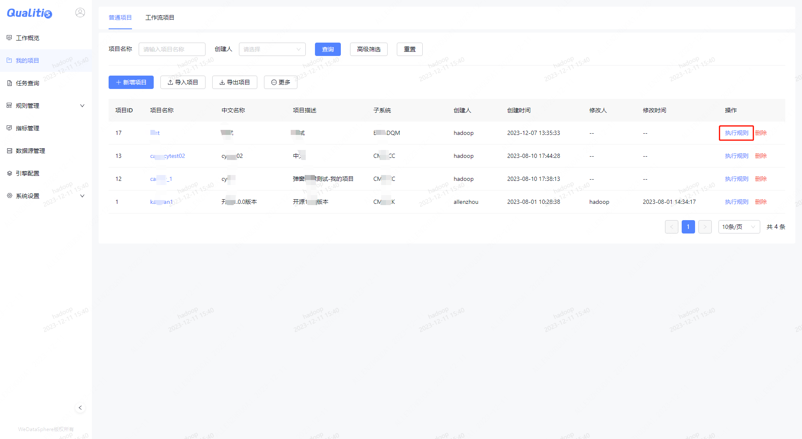
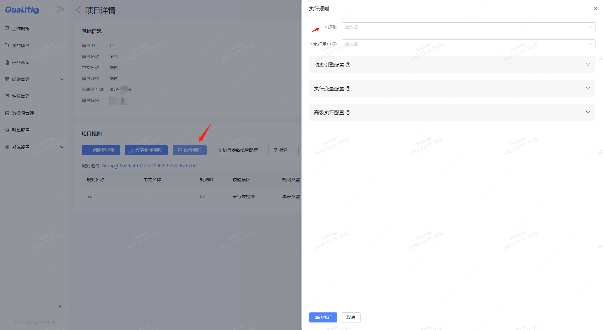

# 触发数据质量任务

## 界面触发
### 执行项目下所有数据质量任务
项目纬度进行任务执行，会将项目下所有规则都提交执行。执行方式如下图所示：


### 执行指定规则列表数据质量任务
规则纬度则是挑选规则进行任务执行。执行方式如下图所示：


## 接口触发

**请求URL：**
- ` http://{host}:${port}/qualitis/outer/api/v1/execution`

**请求方式：**
- POST

**请求格式：**
- json

**Query参数：**

|参数名 |必选 | 类型 | 说明|
| -- | -- |-- |-- |
|app_id  |是 |  string  |系统分配的授权应用APP_ID.|
|timestamp  | 是  | string | 时间戳。毫秒级的时间戳，时效性：7天|
|nonce |  是  | string | 随机数，长度为5|
|signature |  是  | string | 加密签名。md5(md5(appId + nonce + timestamp) + app_token)，其中md5生成32长度，小写|

其中app_id和app_token可以在qualitis_auth_list表中配置。也可以使用默认创建好的app_id和app_token
app_id: linkis_id
app_token:  a33693de51

**Body参数：**

|参数名|必选|类型|说明|
|:----    |:---|:----- |-----   |
|project_id |否  |long |项目id，执行该项目下所有的规则  |
|rule_list |否  |list<long> |  规则id列表，执行指定的规则 |
|partition |否  |string | 分区，用于替换执行中任务的分区   |
|execution_user |是  |string | 执行用户，执行该规则的用户    |
|create_user |是  |string | 创建用户，执行的规则的创建用户    |


示例：
```
curl -X POST \
  'http://localhost:8090/qualitis/outer/api/v1/execution?app_id=linkis_id&timestamp=1570427824782&nonce=11111&signature=37de1518238a41e98d3c6be498c44bfe' \
  -H 'Cache-Control: no-cache' \
  -H 'Content-Type: application/json' \
  -d '{
 "project_id":1,
 "execution_user":"admin",
 "create_user":"admin"
}'
```
