# 一. 简介

Qualitis是一个数据质量管理系统，通过提供质量规则定义，动态任务配置，数据质量结果可视化，校验状态可监控的功能，用于监控生产中重要数据的质量情况。提供多使用角度的一整套统一的流程来定义和检测数据的质量并及时报告问题。

# 二. 特性

## 1\. 可配置执行资源

Qualitis的校验任务以spark
sql的查询操作为主，不同的用户校验任务的数据量，占用资源不尽相同，所以我们提供给每个用户修改默认资源配置的接口，包括常用的**队列选取**，**引擎的并发数**，**执行器实例数**等等。

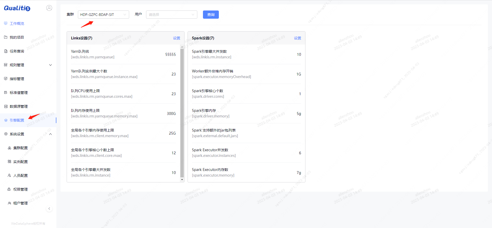

也可在每次执行前加入仅对当前任务会话有效的配置。

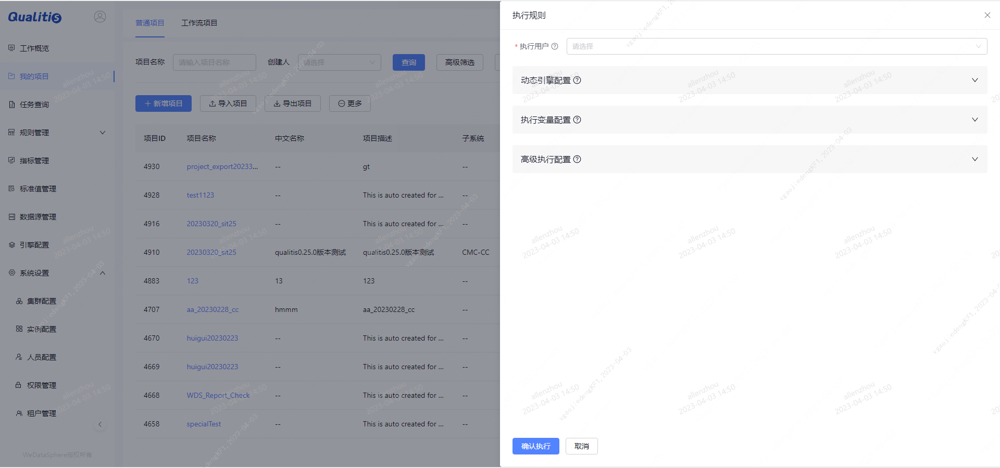

## 2\. 可扩展主备服务

Qualitis各个服务之间是幂等的，可以通过同时起多个Qualitis服务，通过VIP对Qualitis服务进行负载均衡进行实现，通过Zookeeper保证多服务线程读写一致性。目前正式环境Qualitis部署有主备两个服务，来应对可能的服务不可用，性能响应问题。

## 3\. 规范化指标管理

在大数据存储下，仅仅对表的校验进而返回的一系列数据源英文信息，很难让业务定位具体的产品，子系统，业务环节中的质量问题，所以我们引入指标的处理，关联具体规则，赋予校验结果真实的业务含义，帮助用户了解生产活动中的数据质量状态。

## 4\. 多维度指标校验

多指标校验，是指我们在一个规则中，SELECT部分可以计算出多个值，并一一对应指标管理中已创建的指标，分别计算指标值，而且整个sql交给用户编辑，解除单指标规则编辑中的限制，多个指标值计算处置后，分别进行结果校验，最终以多维度都通过校验，才算整个规则校验是通过的。

## 5\. 规则内置模板库

Qualitis内置常用的单表规则模板，跨表规则模板。

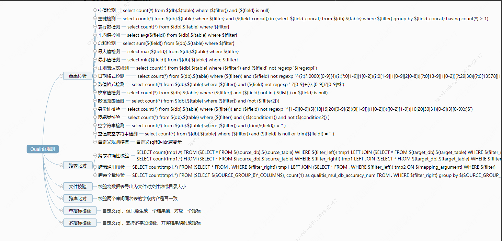

并可在"规则模板"功能新增和编辑自定义模板。

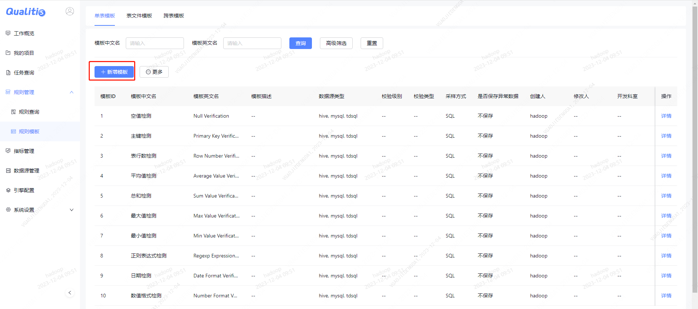

## 6\. 校验结果运营推送

Qualitis可查看每个规则校验情况（查看日志，查看状态），并整合成质量分析报告表格，包含：规则名称，数据源信息，校验状态，历史值，任务时间等。我们定时推送每日校验任务到不同部门用户的记录表中，请向管理员咨询表信息并提单申请访问。

# 三. 命名规范

## 1\. 项目和规则命名规范

-   项目：
    \-- 英文名
    (必填)：只支持英文名、数字和下划线，必须全局唯一，长度限制 ：64
    \-- 中文名 (非必填，方便查询)：中文、英文、数字、下划线 ：128

-   规则：
    \-- 英文名 (必填)：只支持英文名、数字和下划线，必须项目下，长度限制
    ：128
    \-- 中文名 (非必填，方便查询)：中文、英文、数字、下划线 ：128

## 2\. 指标名的拼接规范

英文名：{子系统英文/二级产品英文/自定义英文}*{指标分类}*自定义英文*{指标值聚合频率}，长度限制：512*

*中文名：{子系统中文/二级产品中文/自定义英文}*{指标分类}*自定义英文*{指标值聚合频率}，长度限制：512

\-- BDP或IT指标使用子系统

\-- BDAP或业务指标使用二级产品

\-- 非以上两类，支持自定义填写第一个字段

指标表需加个维度字段：SYSTEM/PRODUCT/CUSTOM

## 3\. 异常数据存储表名称规范

Hive分区表名：{项目英文名}\_{规则名}

# 四. 使用说明

## 1\. 系统登录

输入账号密码登录，即可访问UI。首页展示了当天任务的概览和及近日趋势变化图表。

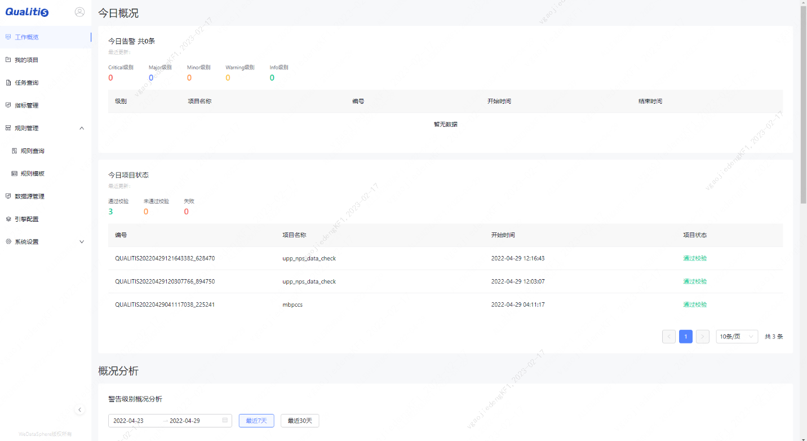

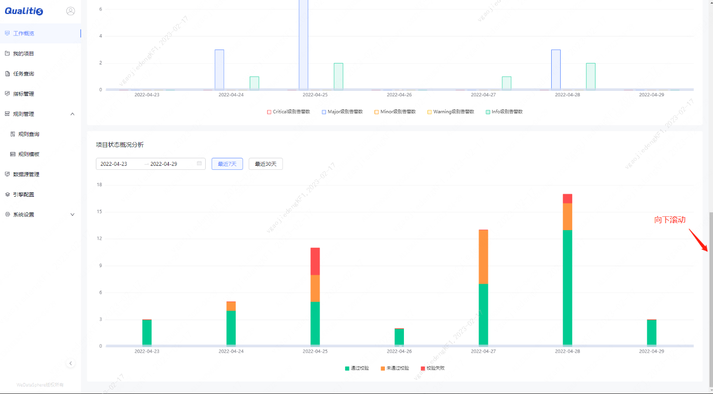

## 2\. 项目管理

项目，即规则的集合，可批量执行规则，授权细粒度权限等，拥有对应项目权限的用户，即拥有查看对应规则信息，任务信息的权限。创建项目："我的项目
\-\-- 新建项目 \-\-- 点击保存"：

-   项目英文名称：项目的英文名称，不能重复。

-   项目中文名称：项目的中文名称，非必选可重复，中文名称存在时，替换英文名称在告警信息展示。

-   项目介绍：对该项目的简单介绍。

-   项目标签：可以指定项目的标签，非必选。

-   项目子系统：可以指定子系统信息，发送告警时默认采用该子系统，优先级弱于规则关联指标的子系统。

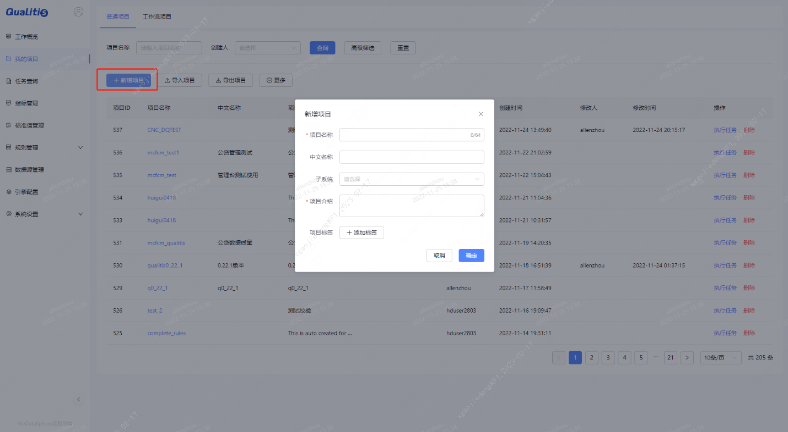

可进行常规的项目筛选：

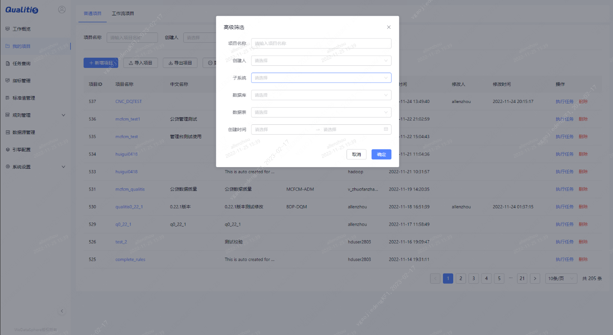

项目列表展示了项目的基础信息，在项目详情页，具备以下功能：

-   项目记录，可定位项目操作历史，包括项目修改，规则执行等。

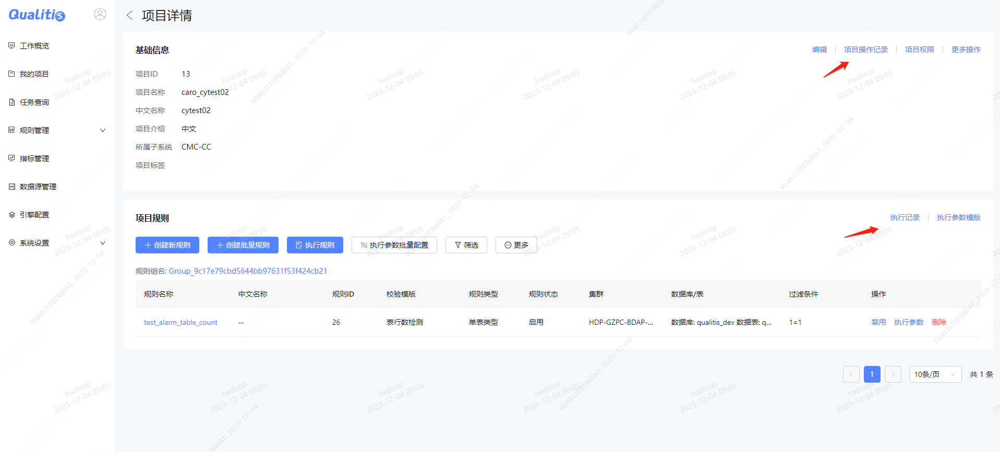

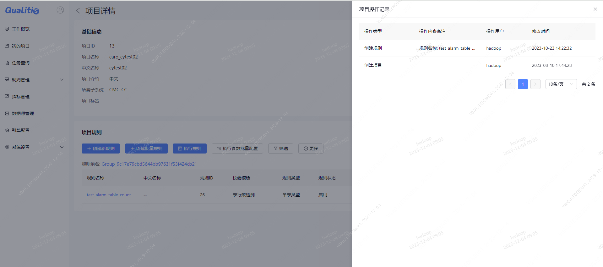

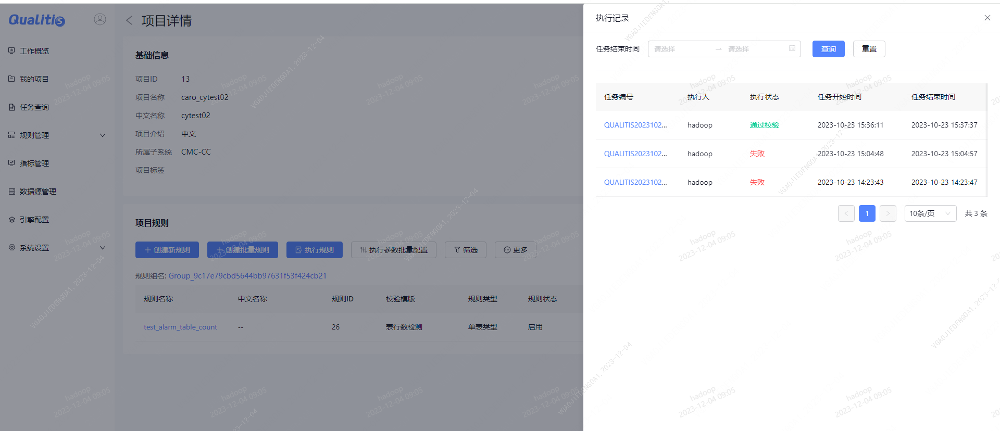

-   项目授权

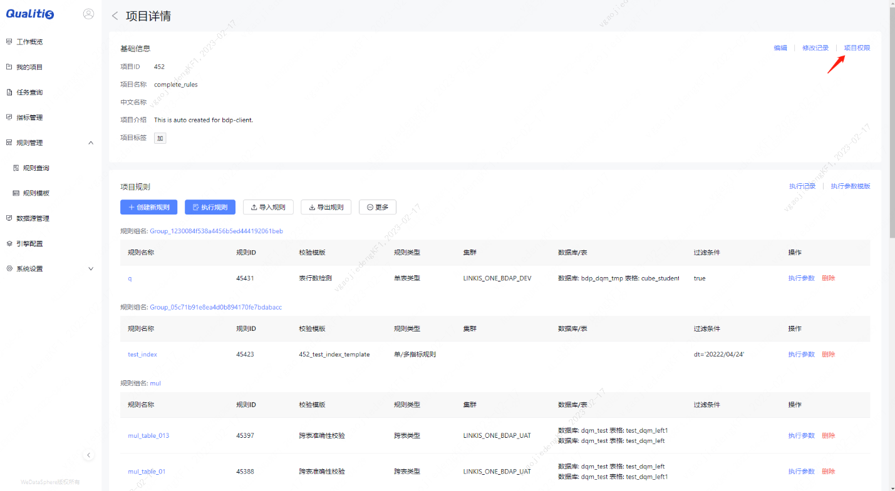

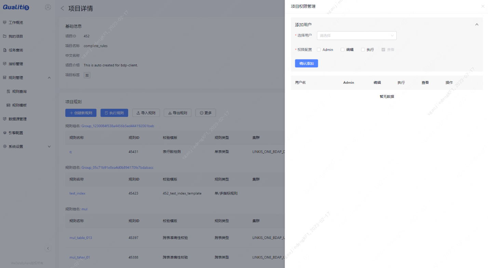

-   支持导入/导出到本地

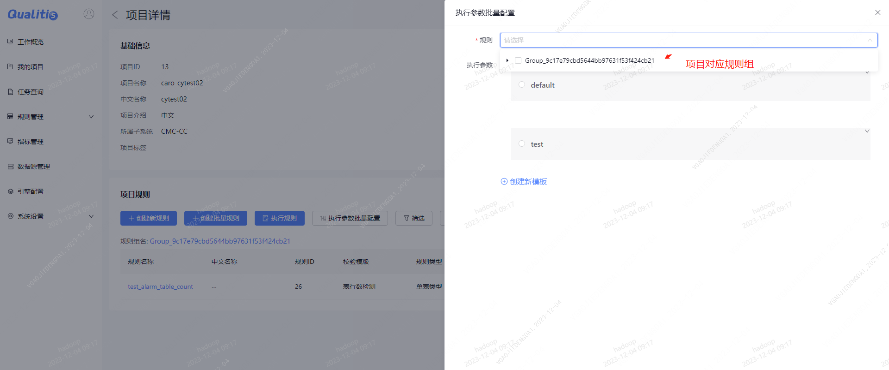

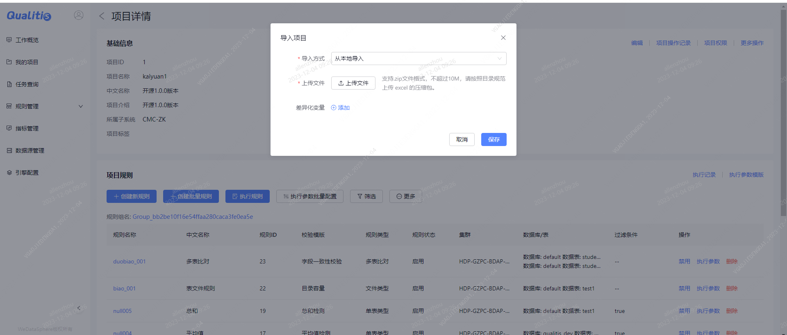

-   规则执行、管理

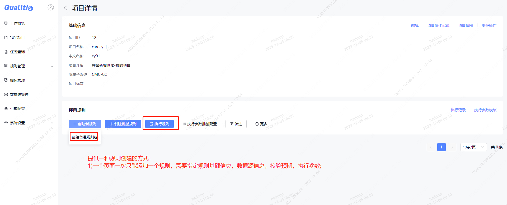

## 3\. 规则管理

点击"添加规则"，选择规则类型（参照第二章，5小节），跳转至规则添加界面。规则的配置分为四部分：

1.  规则基础信息
    技术规则的名称，同一项目中不可重复。

2.  规则数据源

3.  规则校验方式

校验方式计算说明：

月波动：将任务的运行结果和本条技术规则本月的运行结果的平均值y进行比较，如果(1-x)\*y\<=r\<=(1+x)\*y，任务通过校验，否则任务不通过校验。

周波动：和月波动同理，计算的平均值是本周的平均值。

日波动：和月波动，周波动同理，计算的平均值是本日的平均值。

固定值：和一个固定值进行比较，比较的方式有等于，大于等等，如果比较选择比较方式是等于，那么如果r=x，那么任务通过校验。

年环比：按照环比的计算：(本年平均值 - 去年平均值) / 去年平均值 = w
%，然后w会与输入的阈值做不等于，等于，大于，小于等比较。

半年环比：将计算周期设置为半年，计算方式同。

季环比：将计算周期设置为一季度，计算方式同。

月环比：将计算周期设置为月，计算方式同。

周环比：将计算周期设置为周，计算方式同。

日环比：将计算周期设置日，计算方式同。

时环比：将计算周期设置时，计算方式同。

4.  规则执行参数

在"项目详情"规则列表右侧，提供规则执行参数模板编辑的快捷入口：

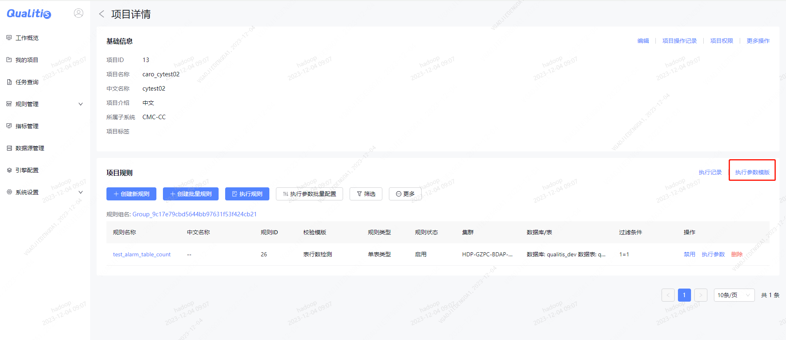

 如此可以快捷配置一整套执行参数。

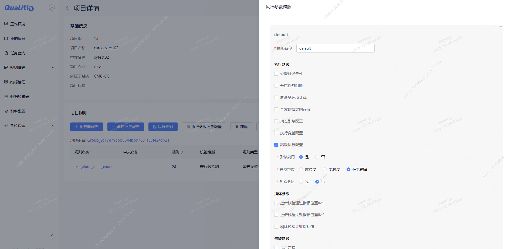

### 3.1 校验类型

1\) 空值检测

-   语义：
    指定一个表中的某一个字段，检测出该字段为空的记录条数。

-   配置：
    首先选择空值检测模版。
    选择希望检测的集群，库名，表名，字段，并填入分区过滤条件，如下图所示：

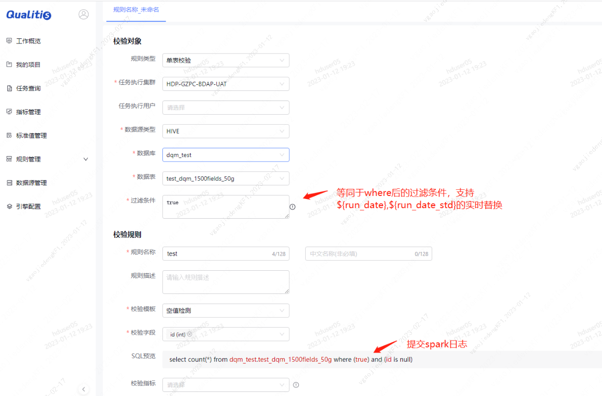

2\) 主键检测

-   语义：
    指定一个表中的多个字段，检测这些字段的组合在该表中是否具有唯一性。

-   配置：
    首先选择主键检测模版。
    选择希望检测的集群，库名，表名，字段，并填入分区过滤条件，如下图所示

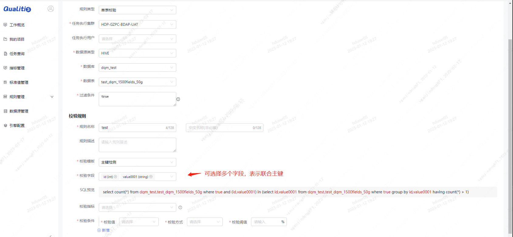

3\) 表行数检测

-   语义：
    指定一个表，检测该表的行数是否达到预期。

-   配置：
    首先选择表行数检测模版。
    选择希望检测的集群，库名，表名，字段，并填入分区过滤条件，如下图所示

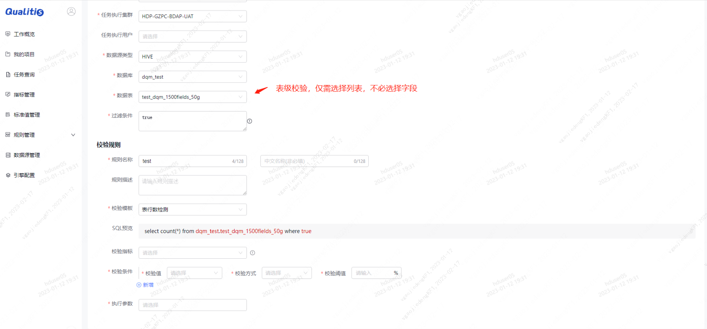

4\) 平均值检测 & 总和检测 & 最大值检测 & 最小值检测

-   语义：
    指定一个表中一个字段，检测该字段的平均值（总和，最大值，最小值类似）是否达到预期。

-   配置：
    首先选择平均值检测模版。
    选择希望检测的集群，库名，表名，字段，并填入分区过滤条件，如下图所示：

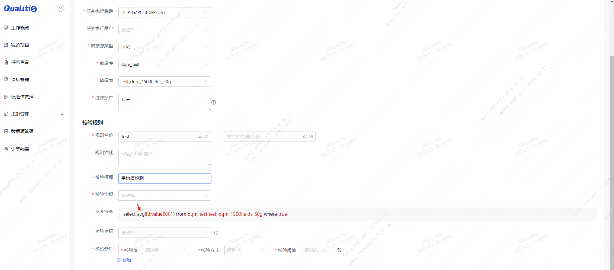

5\) 正则表达式检测 & 数值格式检测 & 身份证检测

-   语义：
    指定一个表中一个字段，找出该字段不满足给定正则表达式（数值格式默认正则表达式即[-?\[0-9\]+(\\\\.\[0-9\])?\[0-9\]\*\$]{.mark}，身份证检测默认即[\^\[1-9\]\[0-9\]{5}(18\|19\|20)\[0-9\]{2}((0\[1-9\])\|(1\[0-2\]))((\[0-2\]\[1-9\])\|10\|20\|30\|31)\[0-9\]{3}\[0-9Xx\]\$]{.mark}，省略了表达式的录入，在此省略不表）的记录条数。

-   配置：
    首先选择正则表达式检测模版。
    选择希望检测的集群，库名，表名，字段，并填入分区过滤条件和正则表达式。如下图所示：

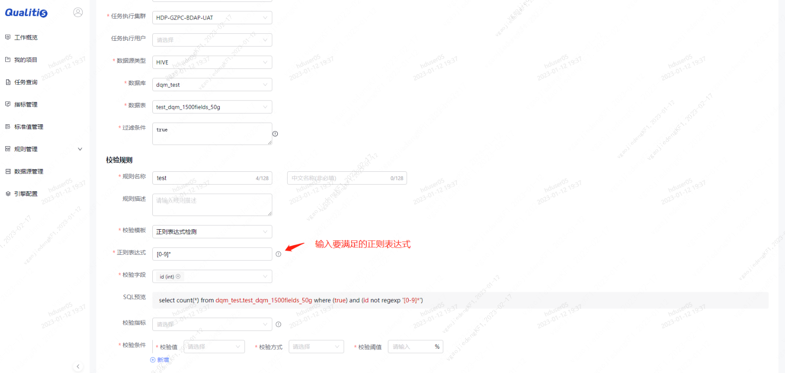

6\) 日期格式检测

-   语义：
    指定一个表中一个字段，找出该字段不满足选中日期格式的字段。

-   配置：
    首先选择日期格式检测模版。
    选择希望检测的集群，库名，表名，字段，并填入分区过滤条件，选中日期格式。如下图所示：

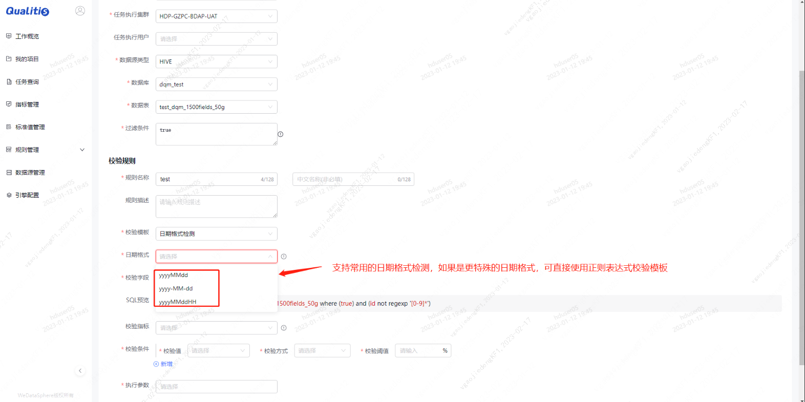

7\) 枚举值检测

-   语义：
    指定一个表中一个字段，找出该字段不在所给枚举值中的记录条数。

-   配置：
    首先选择枚举值检测模版。
    选择希望检测的集群，库名，表名，字段，并填入分区过滤条件和枚举值(逗号分隔)。如下图所示：

8\) 数值范围检测

-   语义：
    指定一个表中一个字段，找出该字段不在所给数值范围中的记录条数。

-   配置：
    首先选择数值范围检测模版。
    选择希望检测的集群，库名，表名，并填入分区过滤条件和数值范围。如下图所示：

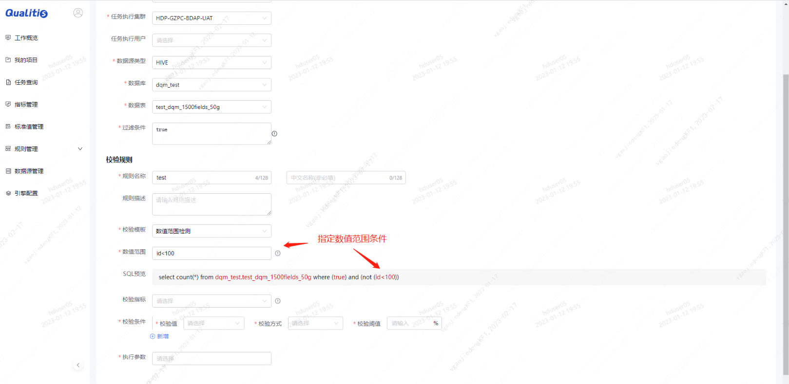

9\) 逻辑类检测

-   语义：
    指定一个表，前置条件和后置条件，找到该表中满足该前置条件，但不满足后置条件的记录条数。

-   配置：
    首先选择逻辑类检测模版。
    选择希望检测的集群，库名，表名，字段，并填入分区过滤条件，前置条件和后置条件。如下图所示：

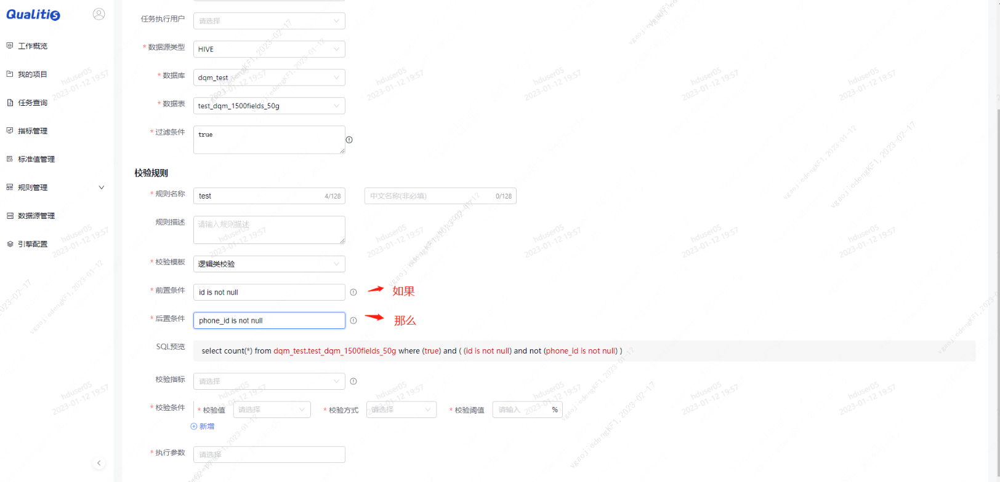

10\) 行数据重复检测

-   语义：
    指定一个表，指定参与行数据重复的字段（支持黑名单和白名单选择），系统会查询重复数据的最大重复数。

-   配置：
    首先选择行数据重复检测模版。
    选择希望检测的集群，库名，表名，黑名单或白名单字段，并填入分区过滤条件。如下图所示：

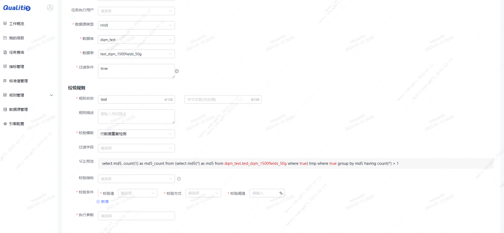

11\) 文件校验

-   语义：
    在特定情况下，hive表文件统计信息，如表大小，表文件数量，也是用户需要检测的重要指标，在Qualitis提供对目录大小、目录文件数、分区数的校验。

-   配置：

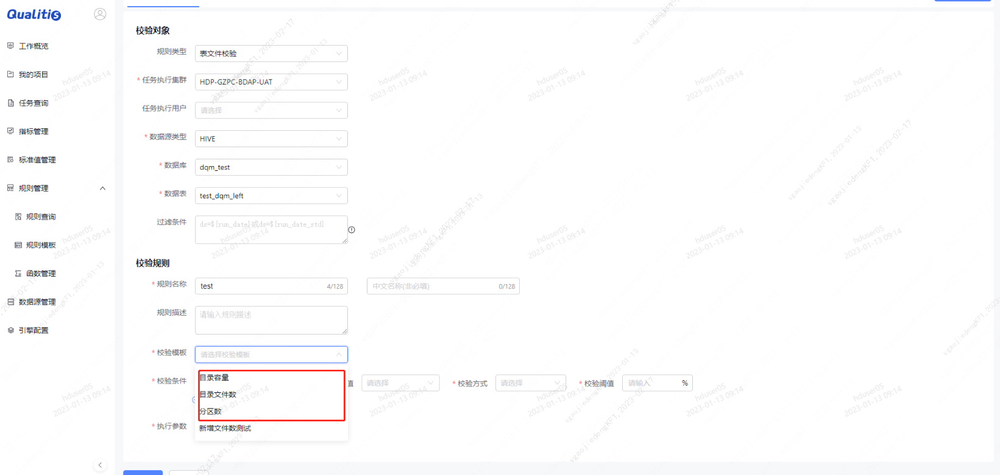

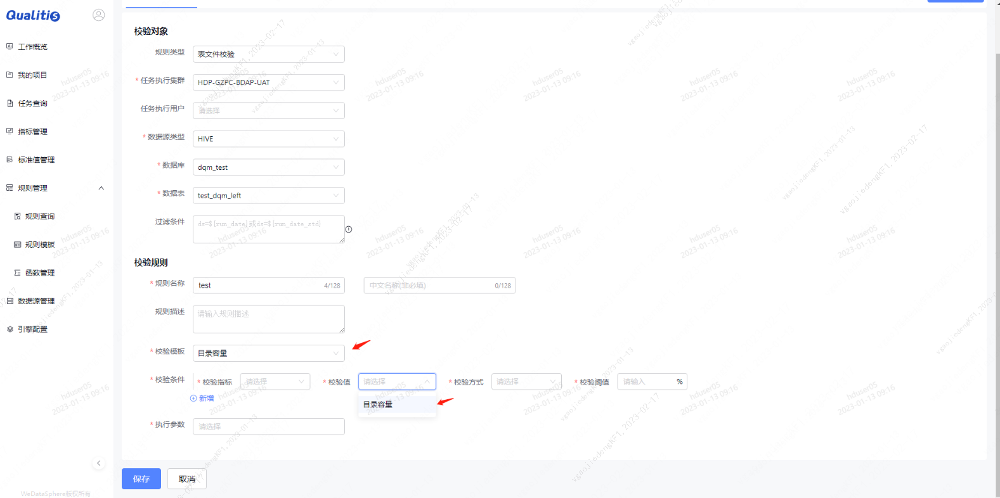

12\) 多表比对（字段一致性校验 & 行数据一致性校验 &
自定义字段一致性校验）

**字段一致性校验**

-   语义：
    字段一致性校验，主要针对于两张表在选定数据范围下，是否满足一致的校验。由名称可以看出校验粒度的区别。

-   配置：

    -   字段一致性校验可以选定两张表一一对应的一个或多个字段，判断查询结果是否一致

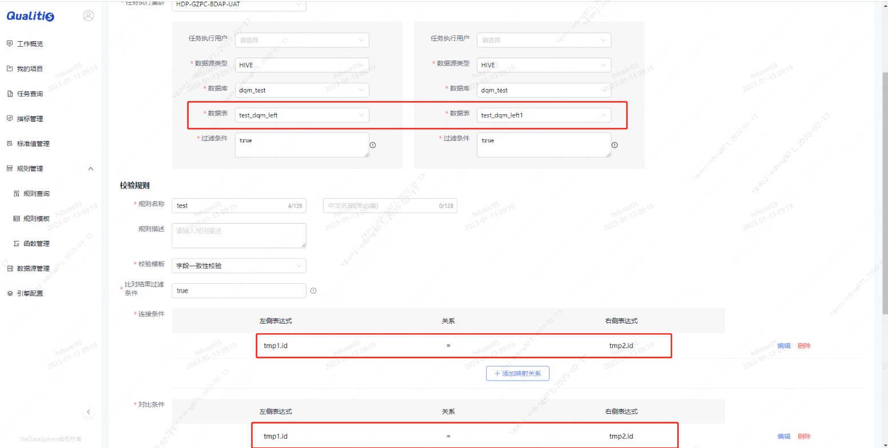

**行数据一致性校验**

-   语义：

行数据一致性校验，对两张表所有数据进行一致性校验，数据源配置与上同，但是无需选择
字段作为映射关系，因为是全量字段的校验；

-   配置

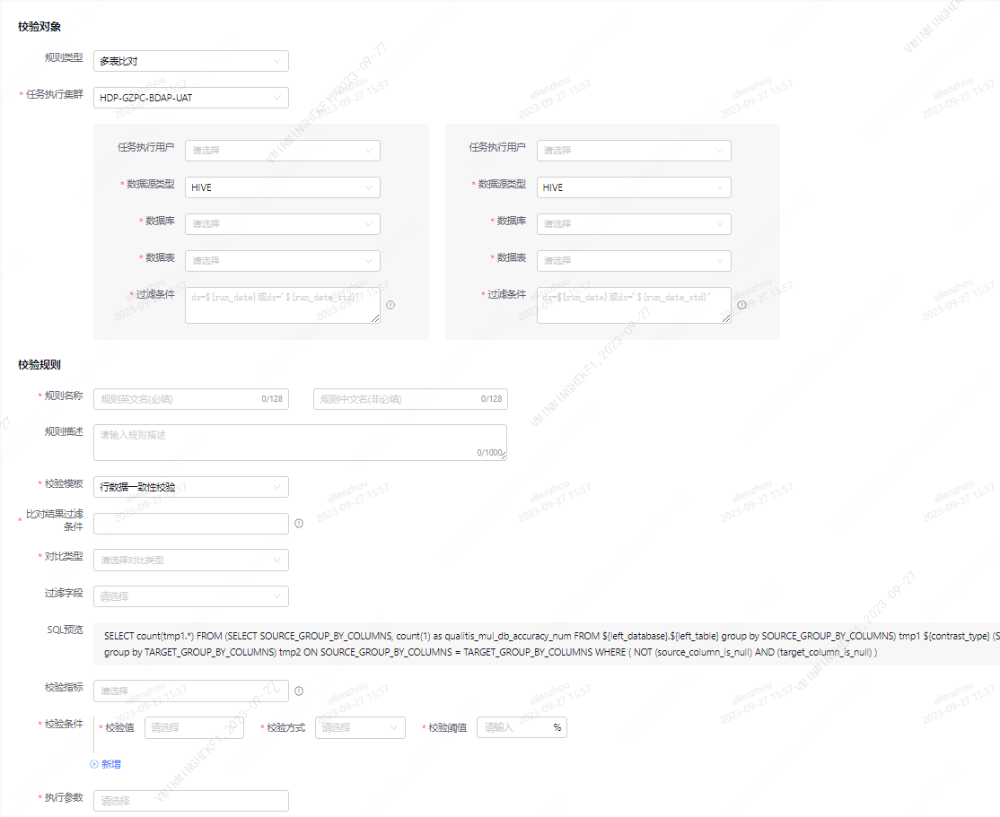

**自定义字段一致性校验**

-   语义

减少对用户配置的输入限制，使得用户可以更加自由地定义要比对的库、表、列信息

-   配置

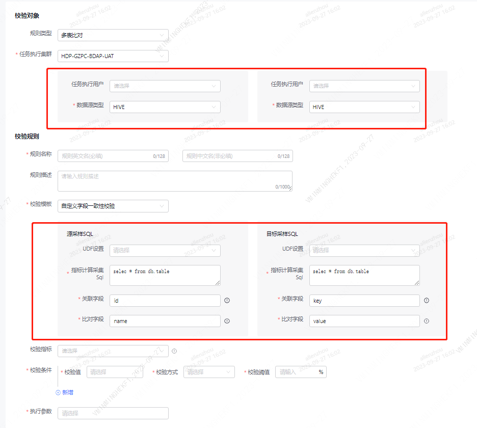

13\) 库一致性比对

-   语义：
    库一致性比对，是多表全量校验规则批量创建的入口，待比较的表数量无法手工配置，故提供了更方便的跨库批量配置方式，可以直接将两个库的同名表，或者特定选择到白名单的非同名表（优先级最高），在黑名单规则（从同名表中过滤）作用下，批量创建。

-   配置：

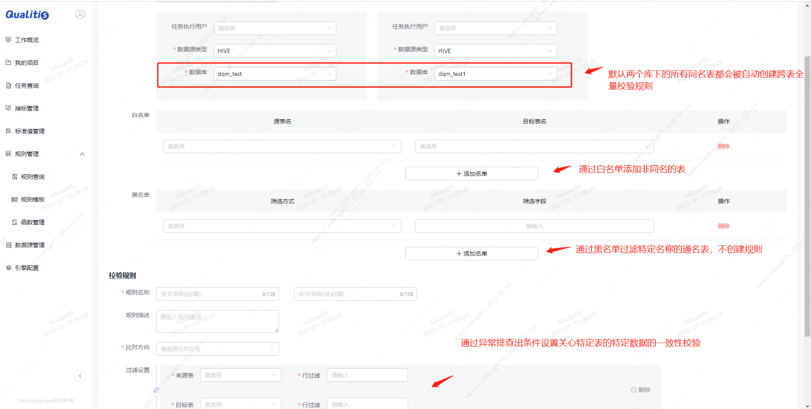

14\) 自定义SQL校验

-   语义：
    多指标校验，在功能上完全包含单指标校验，可使用执行变量，在同一个sql中关联多个指标，完成多个校验结果的比较。

-   配置:

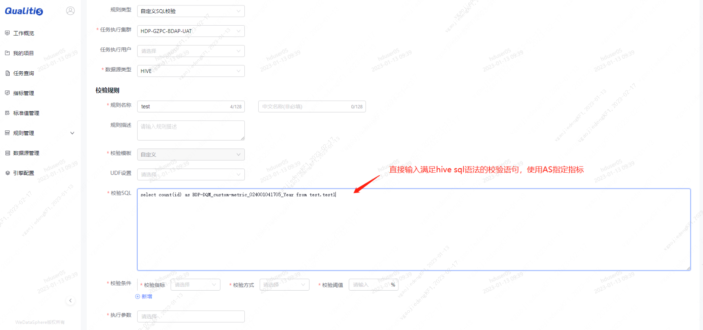

15\) 跨集群多表比对（自定义字段一致性校验 & 数据行数比对）

**自定义字段一致性校验**

-   语义：

同多表比对下的自定义字段一致性校验一样，也是为了减少对用户配置的输入限制，使得用户可以更加自由地定义要比对的库、表、列信息。不同之处在于，支持跨集群的比对

-   配置

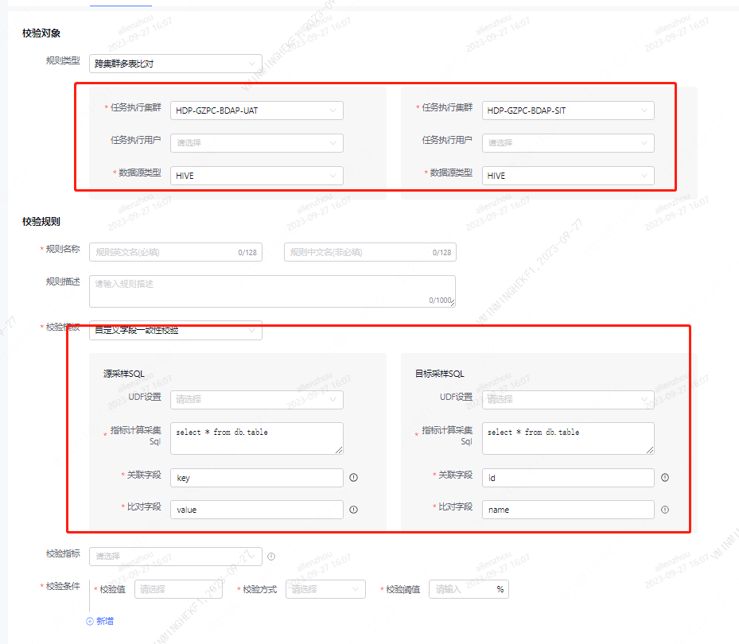

### 3.2 规则查询

规则数据源是用户关心的出发点，Qualitis支持从数据源定位所关联的规则，"选定数据源范围
\-\-- 点击表名 \-\-- 覆盖规则的字段"

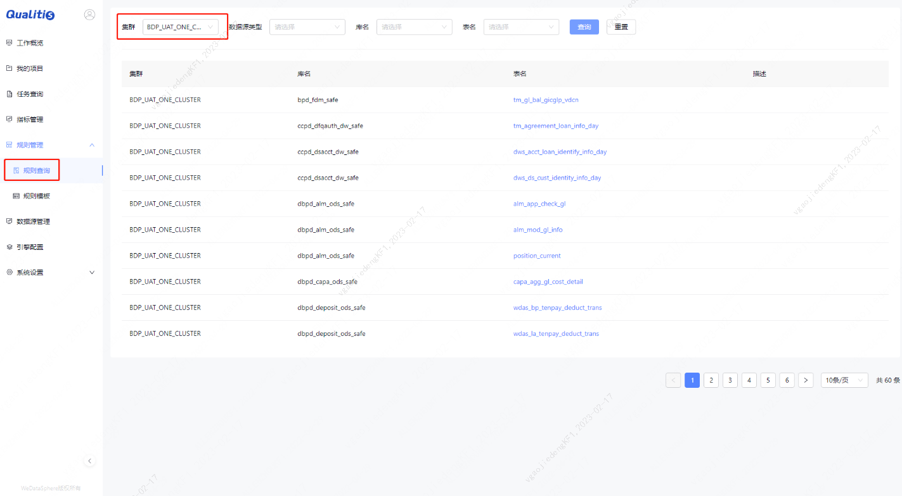

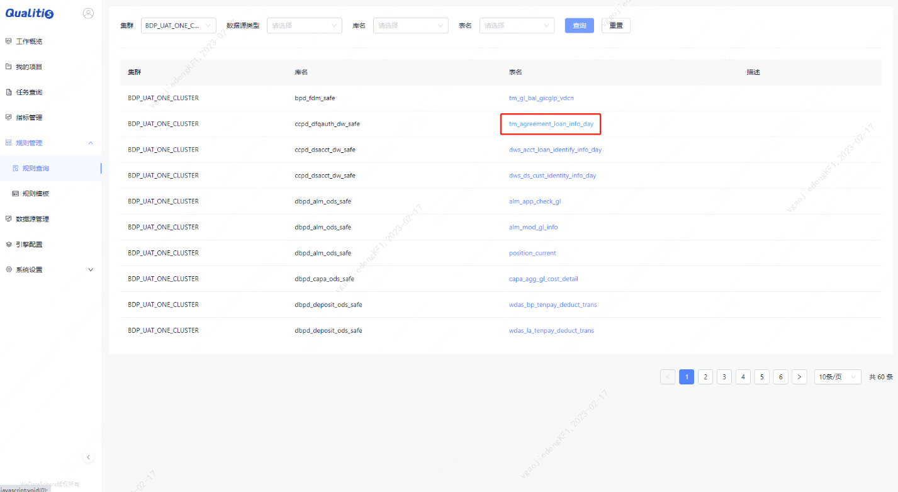

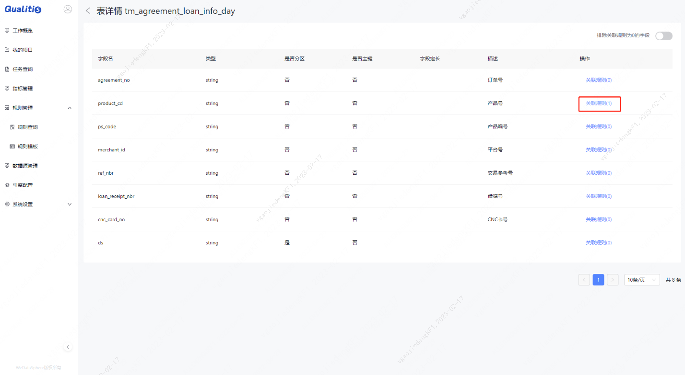

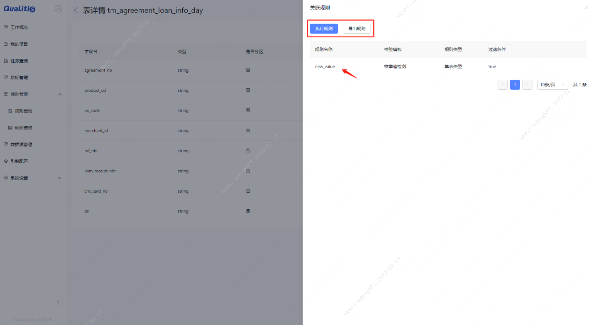

### 3.3 规则模板

**权限配置**

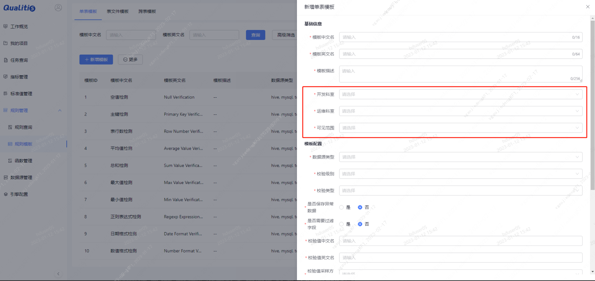

为了更安全、更灵活地管理数据，权限被细分到了单个数据的级别，如上图红框中所示，每个数据的使用权限都与配置的开发科室、运维科室及可见范围紧密相关。

-   开发科室：非运维模式下，该科室下的所有用户具有对当前数据的编辑权限和可见权限

-   运维科室：非运维模式/运维模式下，该科室下的所有用户具有对当前数据的编辑权限和可见权限

-   可见范围：可以配置多个科室，科室下的所有用户具有对当前数据的可见权限

其中开发科室和运维科室会根据当前登录用户的角色类型不同，对科室的选择范围也有所不同（可见范围除外，可选择所有科室）。

-   系统管理员：所有科室

-   部门管理员：所管辖的科室

-   普通用户：自身所属科室

补充说明：

-   编辑权限是指，用户能否编辑或删除这条数据

-   可见权限是指，用户能否看到这条数据，直接影响首页的列表查询结果

-   系统管理员基本无视任何权限，能够看见和编辑所有数据

-   如果开发科室/运维科室下拉没有数据，应该联系具有超级管理员权限的用户配置帮忙科室及角色

-   仅超级管理员和部门管理员能够设置【全行】的可见范围

**模板类型细分**

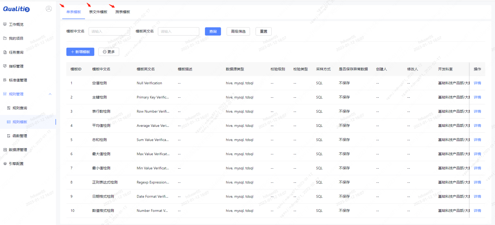

对模板列表数据细分化管理，分为：单表模板、表文件模板、跨表模板，方便用户根据自己选择获取匹配类型数据；

**表单模块化**

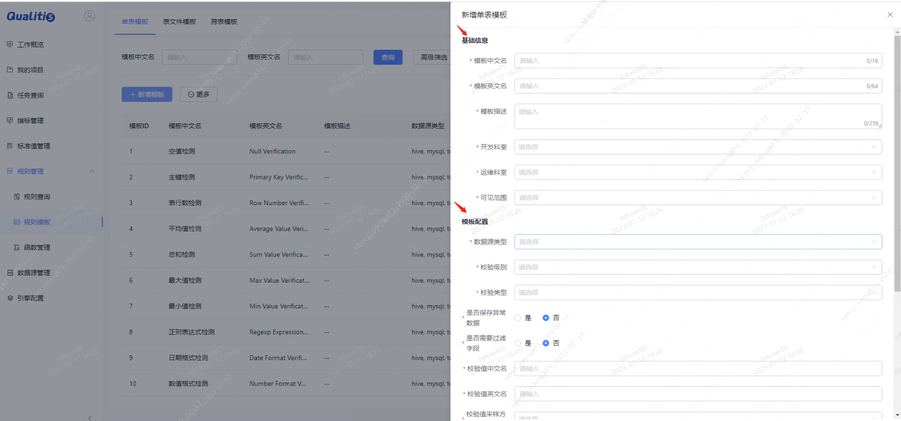

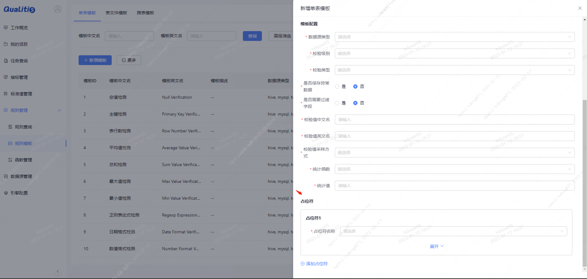

规则模板参数模块化，表单内容分为

-   基础信息：命名方式(自定义命名、规范命名)、模板中文名、模板英文名、模板描述、开发科室、运维科室、可见范围;

-   模板配置：数据源类型、校验级别、校验类型、是否保存异常数据、是否需要过滤字段、校验值中文名、校验英文名、校验采样方式、统计函数、统计值、是否使用UDF、采样SQL、是否固化校验方式、校验方式;

-   占位符：
    单表\--\>数据库、数据表、校验字段、基础过滤条件、枚举值、数值范围、表达式、标准值表达式;\
    表文件\--\>数据库、数据表、基础过滤条件;\
    跨表\--\>数据库、数据表、基础过滤条件、源数据库、源数据表、目标数据库、目标数据表、源基础过滤条件;

## 4\. 指标管理

### 4.1 描述

仅仅对表数据校验进而返回的一系列数据源英文信息，很难让业务定位具体的子系统，业务环节中的质量问题，所以我们引入指标的处理，上文已经出现我们所用的指标，关联具体规则，赋予校验结果真实的业务含义，帮助用户了解生产活动中的数据质量状态。在系统中的入口如下：

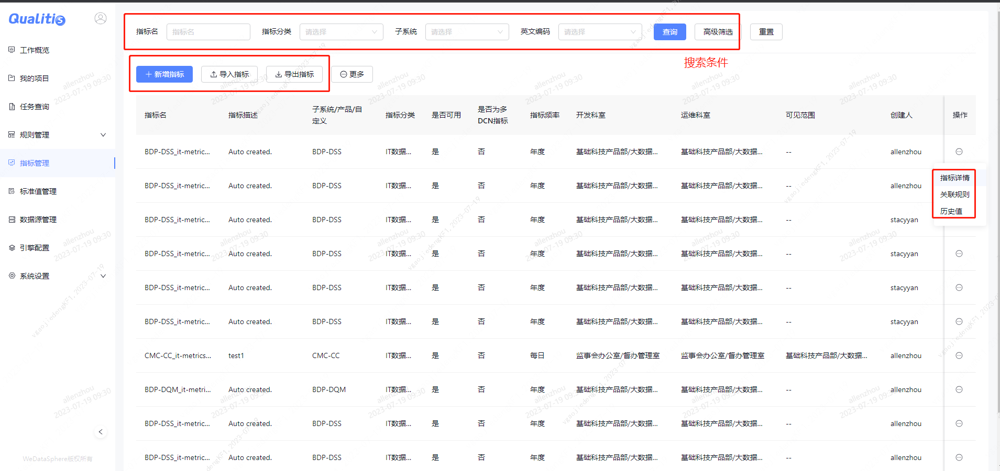

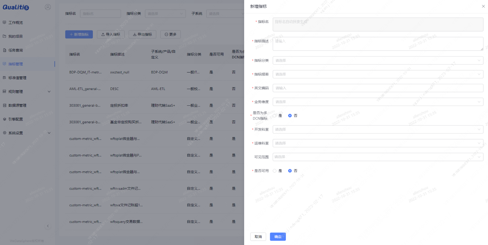

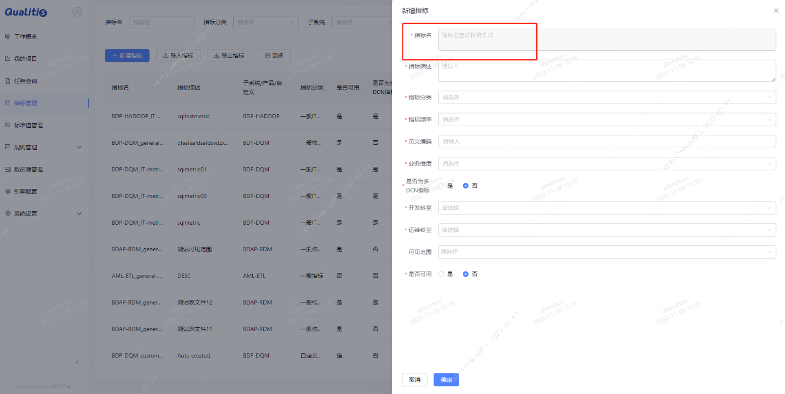

### 4.2 功能目标

指标管理提供给用户维护指标的常用功能（创建，查询，导入，导出，关联规则，关联历史值，指标计算结果上传等），关联规则即可有指标查询使用该指标的规则，关联历史值即该指标关联的规则（包括已删除的规则）执行的历史结果记录；在知悉IMS系统监控指标的功能及应用前提下，Qualitis部署的规则关联指标的意义，主要是各部门在深度使用Qualitis之后，通过Qualitis反映的质量问题（Qualitis执行完成后向IMS进行上报的指标值）将关联各业务部门数据质量管控的KPI。

### 4.3 权限配置

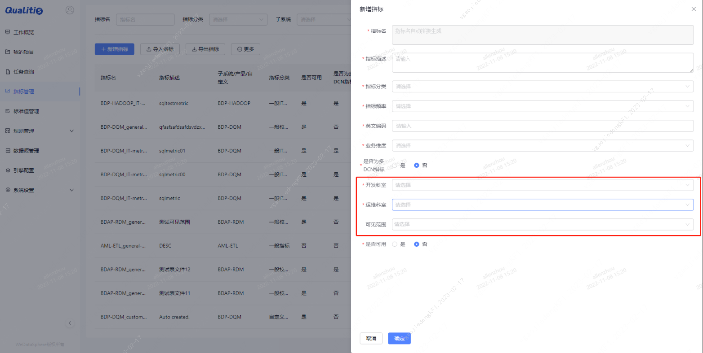

为了更安全、更灵活地管理数据，权限被细分到了单个数据的级别，如上图红框中所示，每个数据的使用权限都与配置的开发科室、运维科室及可见范围紧密相关。

-   开发科室：非运维模式下，该科室下的所有用户具有对当前数据的编辑权限和可见权限

-   运维科室：非运维模式/运维模式下，该科室下的所有用户具有对当前数据的编辑权限和可见权限

-   可见范围：可以配置多个科室，科室下的所有用户具有对当前数据的可见权限

其中开发科室和运维科室会根据当前登录用户的角色类型不同，对科室的选择范围也有所不同（可见范围除外，可选择所有科室）。

-   系统管理员：所有科室

-   部门管理员：所管辖的科室

-   普通用户：自身所属科室

补充说明：

-   编辑权限是指，用户能否编辑或删除这条数据

-   可见权限是指，用户能否看到这条数据，直接影响首页的列表查询结果

-   系统管理员基本无视任何权限，能够看见和编辑所有数据

-   如果开发科室/运维科室下拉没有数据，应该联系具有超级管理员权限的用户配置帮忙科室及角色

业务维度（推荐使用自定义维度）：

~~(1)子系统\-\-\-\--\>subSystemName\-\-\-\--\>cmdb子系统;~~

~~(2)产品\-\-\-\--\>productName\-\-\-\--\>cmdb产品信息;~~

(3)自定义\-\-\-\--\>用户自定义输入；

指标分类（推荐使用自定义监控指标）：

~~(1)IT数据监控指标\-\-\-\--\>it-metrics~~

~~(2)业务数据监控指标\-\-\-\--\>product-metrics~~

(3)自定义监控指标\-\-\-\--\>custom-metrics

英文编码：校验是否存在相同英文编码指标，存在就编辑，不存在就新增；

指标频率：

(1)每日\-\-\-\--\>Daily

(2)月度\-\-\-\--\>Monthly

(3)季度\-\-\-\--\>Quarterly

(4)半年度\-\-\-\--\>HalfYear

(5)年度\-\-\-\--\>Year

(6)单次\-\-\-\--\>Single

## 5\. 任务管理

规则创建完毕，接下来即可提交规则，规则提交可以从两个纬度执行，项目纬度和规则纬度。

项目维度

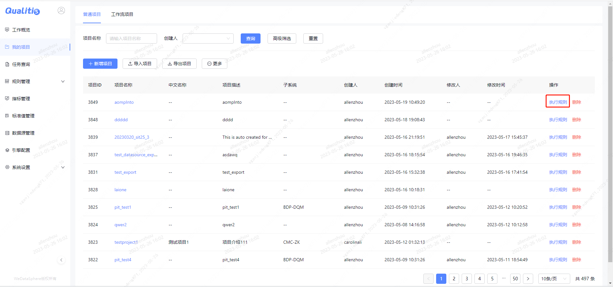

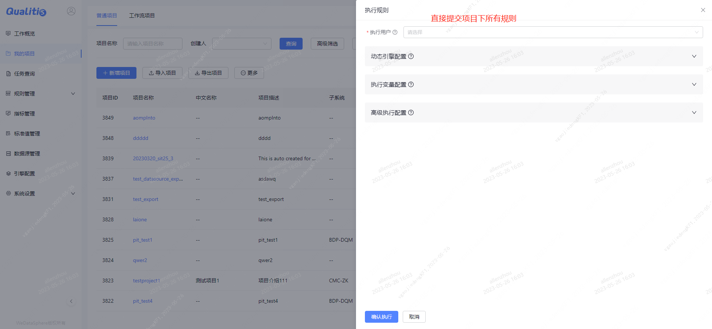

规则维度

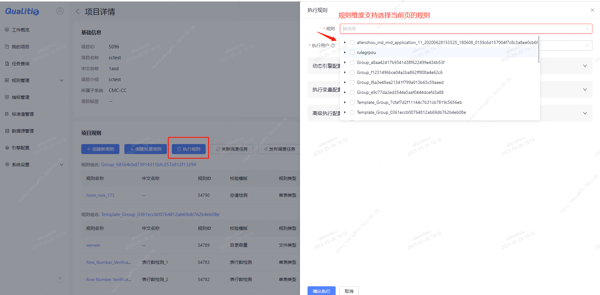

执行弹窗可对当前任务进行一系列配置：


动态引擎配置：

YARN参数

(1)YARN 队列名                  wds.linkis.rm.yarnqueue   

(2)YARN 队列实例最大个数  wds.linkis.rm.yarnqueue.instance.max    30

(3)YARN 队列CPU使用上限  wds.linkis.rm.yarnqueue.cores.max        150

(4)YARN 队列内存使用上限   wds.linkis.rm.yarnqueue.memory.max   300G

Spark参数

(1)Spark Driver 内存使用上限            wds.linkis.rm.client.memory.max    20G

(2)Spark Driver CPU Cores 使用上限    wds.linkis.rm.client.core.max    10

(3)Spark Executor 并发数                    spark.executor.instances  2

(4)Spark Executor 内存数                    spark.executor.memory    3g

~~Flink参数~~

~~预留，当前版本无参数设置~~


内置变量：

(1)run_date

(2)partition

任务提交成功后，在"任务查询"可看到任务提交的状态，日志，校验详情等：


注意，任务状态和备注可以快速反映数据问题，是首要需要关注的信息：


## 6\. 数据质量分析

1）汇总校验结果并上传HDFS

主要是将一段时期，选中状态的校验结果进行汇总并上传HDFS，数据源必选集群，数据库，可选表名（不选表名即收集数据库下所有执行过任务的表），数据源关联的校验结果会将不同的表写入同一个excel的不同sheet中，并以表名区分，同时是可以指定代理用户的，会将任务记录上传到代理用户的HDFS路径。


质量问题数据，也会被保存到异常数据中间表中，会按照当前执行的日期作为分区存储，目前仍需切换至hive
cli查看异常数据内容。


## 7\. 在BDAP集群接入DSS工作流使用

工作流数据校验是Qualitis数据质量校验重要的一个使用方式，依托于DSS工作流的设计，不仅可以对已有hive数据进行校验，还可以对各种ETL的中间表数据进行校验，要求对用户使用工作流有一定的熟悉。

Qualitis同步DSS双中心设计，实现了开发中心与生产中心的部署，是为了将编辑校验规则与定时校验跑批分隔开，用户在DSS开发中心服务编辑规则，可进行多次执行测试与规则调整，期间的规则都是存储在Qualitis开发中心，确认无误，进行发布，会在Qualitis生产中心生成一模一样的规则，生产中心的规则即可被WTSS定时调度执行，只需在Qualitis生产中心，或者WTSS观察具体的校验结果即可。


使用方式主要是"拖拽 \-- 双击节点进入内嵌规则编辑页面 \-- 保存并执行 \--
发布"，发布之后至wtss进行调度操作。


 在双击CheckRules节点后，除了新建规则，还可以选择数据源从已有的规则复制。


如果要对上游的几点产生的临时表做校验，可以切换成"上游表"，注意需要上游节点向校验节点连线：


在双击ShellRules节点后，提供一个脚本编辑框，供指令化批量创建规则，每一行必须包含\--rule-name、\--cmd等基础配置。


我们提供一下案例供参考使用：

表行数校验

\--rule-name single_table_rows \--cmd
\'expectTableRows(\"LINKIS_ONE_BDAP_UAT.dqm_test.test_dqm_left:true\",
false, false, false, null, false, null)\';

\--rule-name single_max \--cmd
\'expectColumnMax(\"LINKIS_ONE_BDAP_UAT.dqm_test.test_dqm_left.id:true\",
false, false, false, null, false, null).fixValueMoreThan(50)\';

\--rule-name single_Min \--cmd
\'expectColumnMin(\"LINKIS_ONE_BDAP_UAT.dqm_test.test_dqm_left.id:true\",
false, false, false, null, false, null).fixValueLessThan(50)\';

\--rule-name single_Avg \--cmd
\'expectColumnAvg(\"LINKIS_ONE_BDAP_UAT.dqm_test.test_dqm_left.id:true\",
false, false, false, null, false, null).fixValueMoreThan(0)\';

\--rule-name single_Sum \--cmd
\'expectColumnSum(\"LINKIS_ONE_BDAP_UAT.dqm_test.test_dqm_left.id:true\",
false, false, false, null, false, null).fixValueMoreThan(50)\';

\--rule-name single_regx \--cmd
\'expectColumnMatchRegx(\"LINKIS_ONE_BDAP_UAT.dqm_test.test_dqm_left.id:true\",
\"\[0-9\]\*\", false, false, false, null, false,
null).fixValueEqual(0)\';

\--rule-name single_date \--cmd
\'expectColumnMatchDate(\"LINKIS_ONE_BDAP_UAT.dqm_test.test_dqm_left.ds:true\",
\"yyyyMMdd\", false, false, false, null, false,
null).fixValueEqual(0)\';

\--rule-name single_number \--cmd
\'expectColumnMatchNum(\"LINKIS_ONE_BDAP_UAT.dqm_test.test_dqm_left.ds:true\",
false, false, false, null, false, null).fixValueEqual(0)\';

\--rule-name single_enum \--cmd
\'expectColumnInList(\"LINKIS_ONE_BDAP_UAT.dqm_test.test_dqm_left.name:true\",
\"\\\"allen\\\",\\\"zhou\\\"\", false, false, false, null, false,
null).fixValueEqual(0)\';

\--rule-name single_range \--cmd
\'expectColumnInRange(\"LINKIS_ONE_BDAP_UAT.dqm_test.test_dqm_left:true\",
\"id \< 100\", false, false, false, null, false,
null).fixValueEqual(0)\';

\--rule-name single_IDCARD \--cmd
\'expectColumnMatchIdCard(\"LINKIS_ONE_BDAP_UAT.dqm_test.test_dqm_left.phone_id:true\",
false, false, false, null, false, null).fixValueEqual(0)\';

\--rule-name single_logic \--cmd
\'expectColumnLogicCheck(\"LINKIS_ONE_BDAP_UAT.dqm_test.test_dqm_left:true\",
\"id is not null\", \"phone_id is not null\", false, false, false, null,
false, null).fixValueEqual(0)\';

\--rule-name mul_table_01 \--cmd
\'expectSpecifiedColumnConsistent(\"LINKIS_ONE_BDAP_UAT\",
\"dqm_test.test_dqm_left:true\|dqm_test.test_dqm_left1:true\",
\"tmp1.id=tmp2.id\", false, false, false, null, false,
null).fixValueEqual(0)\';

\--rule-name mul_table_02 \--cmd
\'expectTableConsistent(\"LINKIS_ONE_BDAP_UAT\",
\"dqm_test.test_dqm_left:true\|dqm_test.test_dqm_left1:true\", false,
false, false, null, false, null).fixValueEqual(0)\';

\--rule-name mul_table_03 \--cmd
\'expectJoinTableSqlPass(\"LINKIS_ONE_BDAP_UAT\",
\"dqm_test.test_dqm_left:true\|dqm_test.test_dqm_left1:true\",
\"tmp1.id=tmp2.id\", \"true\", false, false, false, null, false,
null).fixValueEqual(0)\';

\--rule-name file_rule_amount \--cmd
\'expectFileAmountCount(\"LINKIS_ONE_BDAP_UAT.dqm_test.test_dqm_left\",
null,
false).addRuleMetricWithCheck(\"BDP-DQM_custom-metric_filetest_Year\",
false, false, false).fixValueNotEqual(0)\';

\--rule-name file_rule_size \--cmd
\'expectFileSizePass(\"LINKIS_ONE_BDAP_UAT.dqm_test.test_dqm_left\",
null,
false).addRuleMetricWithCheck(\"BDP-DQM_custom-metric_filesizetest_Year\",
false, false, false).fixValueEqual(\"0 B\")\';

我们开发了业务定制的 checkalert
节点（开源未对接告警系统暂不支持），主要的目的是指定告警来源表，将其告警内容发送到 IMS 告警系统。


-   告警主题，默认是节点名称，最终体现为 IMS 告警通知的标题。

-   默认告警人，默认告警人会受到普通告警数据，通知方式是企业微信、邮件。

-   高等级告警人，高等级告警人会受到高等级告警数据，通知方式是企业微信、邮件、电话。

-   告警表，告警数据来源表。

-   过滤条件，对告警数据支持指定过滤条件。

-   默认告警筛选列，指定表的某一列，作为是否告警的判断标准，0 不告警，1
    告警

-   高等级告警列，指定表的某一列，作为是否高等级告警的判断标准，0
    不告警，1 告警

-   内容展示列，选择表的某几列，作为告警通知的内容展示。

实例如下：

IMS智能监控：

Qualitis Check Alert

\[告警主题\] checkalert_7911

\[告警时间\] 2023-04-04 18:18:18

\[告警内容\]

\[高等级告警\]

dz\|mz

cwl1 \| hxj2

cwl2 \| hxj3

\[一般告警\]

dz\|mz

cwl1 \| hxj2

cwl2 \| hxj3

\[告警节点\] DQM_TEST_25:dqm_huigui:checkalert_7911

\[告警人\] v_wbxjhuang;allenzhou

\[高等级告警人\] v_wbxjhuang;allenzhou

增加checkalert
节点(数据告警规则)查看入口，也方便用户有一个整体的管理视图，入口如下图：


## 8\. 关系型数据的质量校验

关系型数据，即指行内广泛应用存储的mysql，tdsql数据库的数据，同样可以应用单表模板校验，跨表模板校验与多指标校验（参考第六章，3小节，关系型数据不支持文件校验规则校验）。不管是在UI上的配置，还是bdp-client的使用，在质量校验流程上只需额外选择数据源即可，在此之前，下文首先介绍下数据源管理功能。


1). 数据源管理

**描述**

此功能依赖linkis-datasource服务，基于http请求在Qualitis提供了管理界面，用户可以通过管理界面，创建，编辑，版本发布，回滚等操作关系型数据源信息，同样可以借助代理功能，使用和管理代理用户的数据源。已保存且发布的数据源，即可在上述质量校验的数据源配置中使用。


Qualitis在初期对关系型数据库类型做了限制，新增数据源只开放mysql和tdsql：

-   点击"新增数据源"，弹出添加界面；

-   选择数据源类型，录入基本信息；

-   连接配置支持共享认证与非共享认证；

    -   共享认证，用户只需输入公共的认证信息（用户名密码，密码管家），每个连接环境共用；

    -   非共享认证，每个连接环境需要单独输入认证信息；

-   继续添加环境，可以配置多个数据源环境，输入数据库地址，端口，用户名，密码等，点击保存；

-   **在使用数据源之前，点击版本，发布数据源版本，注意最新发布的数据源版本是对外提供连接的可用版本；**

-   可查看和调试连接，确认是有效数据源连接；


**权限配置**


为了更安全、更灵活地管理数据，权限被细分到了单个数据的级别，如上图红框中所示，每个数据的使用权限都与配置的开发科室、运维科室及可见范围紧密相关。

-   开发科室：非运维模式下，该科室下的所有用户具有对当前数据的编辑权限和可见权限

-   运维科室：非运维模式/运维模式下，该科室下的所有用户具有对当前数据的编辑权限和可见权限

-   可见范围：可以配置多个科室，科室下的所有用户具有对当前数据的可见权限

其中开发科室和运维科室会根据当前登录用户的角色类型不同，对科室的选择范围也有所不同（可见范围除外，可选择所有科室）。

-   系统管理员：所有科室

-   部门管理员：所管辖的科室

-   普通用户：自身所属科室

补充说明：

-   编辑权限是指，用户能否编辑或删除这条数据

-   可见权限是指，用户能否看到这条数据，直接影响首页的列表查询结果

-   系统管理员基本无视任何权限，能够看见和编辑所有数据

-   如果开发科室/运维科室下拉没有数据，应该联系具有超级管理员权限的用户配置帮忙科室及角色

2). 元数据接口查询

元数据接口查询，即关系型数据库的库列表，表列表，字段列表的查询，当规则配置时指定了数据源，下文的库，表，字段下拉框将会查询对应数据源下的库表信息，其余质量校验配置与离线数据无二。如图：


3). 质量校验流程

关系型数据源的校验，同样是创建项目规则，提交校验任务，执行结果查看。

## 9\. 新值监控

在用户接入qualitis进行新值监控时，枚举值校验只能固定枚举范围，新值不在枚举范围，无论是否合理都会被认为校验不通过，当用户需要加入合理新值再次校验时，系统不支持枚举范围动态加入合理的新值。新增"枚举新值监控"、"数值范围新值监控"系统模板，以支持枚举范围、数值范围的新值监控，模板如下图：


模板配置到规则，由用户确认新值是否合理，再确定是否将新值加入到枚举范围，如下图：


## 10\. 执行参数模板管理

1）常规配置


用户配置规则时，通用参数采用执行参数模板来统一管理，表单模板化分为：

-   执行参数：
    (1)设置过滤条件(是)-\>单表过滤条件、源表过滤条件、目标表过滤条件;
    (2)开启任务阻断；
    (3)聚合多环境计算；
    (4)异常数据定向存储(是)-\>存储集群、代理用户、异常数据存储库；
    (5)动态引擎配置(可多配,是)-\>参数类型(YARN参数、Spark参数、Flink参数、自定义参数)、参数名称、参数值;

    (6)执行变量配置(可多配,是)-\>变量类型(内置变量、自定义变量)、变量名称、变脸值；

    (7)高级执行配置-\>引擎复用(是、否)、并发粒度(库粒度、表粒度)、动态分区(是\-\--\>顶层分区、否);

-   指标参数：上传校验通过指标值至IMS、上传校验失败指标值至IMS、剔除校验失败指标值；

-   告警参数：是否告警(可多配,是)-\>告警事件、告警级别、告警接收人；

2）批量配置

对于存量的规则，用户往往需要批量修改配置，除配置规则时指定执行参数模板之外，支持执行参数模板管理界面应用到批量规则中，覆盖现有配置,系统入口如下：


补充说明：

-   告警事件：

校验成功：仅通过校验的任务

校验失败：未通过校验+阻断、引擎层失败的任务

执行完成：通过校验，未通过校验

-   当执行参数模板配置了过滤条件(单表、源表、目标表)，规则在配置执行参数模板时过滤条件会进行覆盖；(优先级：执行参数模板\>规则配置的过滤条件)

## 11\. 租户管理

将执行用户与特定租户关联，隔离Linkis Ecm
机器，保证质量校验任务与其他类型任务互不影响，租户管理提供给用户维护租户的常用功能(创建、查询、编辑、删除、成员管理)，每一个租户ID对应一个成员管理，系统入口如下：


## 12\. 系统管理

### 1). 用户管理

新增用户表单,增加职位角色下拉框选项(开发、运维、测试)、BDP-CLIENT-TOKEN，每个用户保证只有一个职位角色，BDP-CLIENT-TOKEN供用户请求BDP服务相关请求携带用户加密信息；


### 2). 代理用户

新增BDP-CLIENT-TOKEN选项，服务请求携带用户加密信息；


### 3). 角色管理

新增角色类型下拉框选项(系统角色、职位角色)，一个用户可以有多个系统角色，但只有一个职位角色；


### 4). 用户角色管理

表单项用户名、角色名采用下拉框选项，当系统管理员、部门管理员角色变动时，对应的项目权限同步进行改动；


### 5). 科室管理

表单项科室来源采用下拉框选项，科室Code自动填充，

-   科室来源：HR系统，所属部门、科室名称的下拉数据来源于HR数据接口；

-   科室来源：自定义，所属部门的下拉数据来源于本地部门管理数据；(注：后台配置文件同步
    department.data_source_from:custom)


### 6). 集群管理

集群名称(Hadoop集群名称)、集群类型（BDP 或者 BDAP，BDP
为核心跑批集群，BDAP 为业务分析集群。一般设置为
BDP，面向科技用户；设置为 BDAP，面向业务用户）、Linkis地址、Linkis
Token（填入QUALITIS-AUTH）、URN（暂未开放，输入"-"）、WTSS和Jobserver配置信息（暂未开放，输入"-"），配置界面如下：


### 7). 实例管理

高可用多实例配置，必须录入所有服务主机
host，可以使任务在多台机器上更新，做到负载均衡，配置界面如下：


# 五. 安装说明

## 一、基础软件安装

Gradle (4.6)；

MySQL (5.5+)；

JDK (1.8.0_141) ；

Linkis（1.0.0+), 必装Spark引擎；

DataSphereStudio (1.0.0+) 可选。如果你想使用工作流，必装
DataSphereStudio。

## 二、安装包下载

[https://github.com/WeBankFinTech/Qualitis](https://github.com/WeBankFinTech/Qualitis)

## 三、编译

gradle clean distZip

## 四、部署

4.1 解压安装包

zip包

unzip qualitis-{VERSION}.zip

tar包

tar -zxvf qualitis-{VERSION}.tar.gz

4.2 连接MySQL，创建表并插入初始数据。

mysql -u {USERNAME} -p {PASSWORD} -h {IP} \--default-character-set=utf8

source conf/database/init.sql

4.3 修改配置文件

vim conf/application-dev.yml

配置说明如下：

注：

\[\] 为必填自定义配置

0 缺省数字，可忽略，暂不启用功能

X 缺省字符，可忽略，暂不启用功能

1\. application.yml

spring:

  profiles:

    active: dev

  jersey:

    type: servlet

  http:

    encoding:

      charset: UTF-8

      enabled: true

      force: true

  messages:

    encoding: UTF-8

    basename: i18n/messages

logging:

  config: classpath:log4j2-\${spring.profiles.active}.xml

server:

  port: 8090

  connection-timeout: 6000000 # 600s

  error:

    whitelabel:

      enabled: false

workflow:

  enable: false

ha:

  enable: false \# 是否开启高可用多实例部署

system:

  config:

    save_database_pattern: save_database_pattern

devOps:

  enable: false \# 是否仅限运维用户访问环境

2\. application-\[dev\].yml

\# spring 配置

spring:

\# datasource，支持主备连接配置 master,worker，无主备可配置成一样的内容

  datasource:

    master:

      username: \[DB_USERNAME\]

      password: \[DB_PASSWORD\]

      private_key: X

      url:
jdbc:mysql://\[DB_HOST_MASTER\]:\[DB_PORT\]/\[DB_NAME\]?createDatabaseIfNotExist=true&useUnicode=true&characterEncoding=utf-8

      driver-class-name: com.mysql.jdbc.Driver

      type: com.zaxxer.hikari.HikariDataSource

    worker:

      username: \[DB_USERNAME\]

password: \[DB_PASSWORD\]

private_key: X

url:
jdbc:mysql://\[DB_HOST_WORKER\]:\[DB_PORT\]/\[DB_NAME\]?createDatabaseIfNotExist=true&useUnicode=true&characterEncoding=utf-8

driver-class-name: com.mysql.jdbc.Driver

type: com.zaxxer.hikari.HikariDataSourc

\# 连接池配置

    hikari:

      minimum-idle: 20

      maximum-pool-size: 500

      idle-timeout: 60000

      max-lifetime: 180000

      leak-detection-threshold: 120000

  jpa:

    hibernate:

      ddl-auto: validate

    database-platform: org.hibernate.dialect.MySQL5InnoDBDialect

    show-sql: false

\# 循环依赖支持

  main:

    allow-circular-references: true

restTemplate:

  thread:

    maxTotal: 200

    maxPerRoute: 100

  request:

    socketTimeout: 100000

    connectTimeout: 2000

    connectionRequestTimeout: 2000

\# 规则解析 spark sql 任务所需配置

task:

  persistent:

    type: jdbc

    username: \[DB_USERNAME\]

password: \[DB_PASSWORD

    private_key: X

\# 必须是支持写入的主库

    address:
jdbc:mysql://\[DB_HOST_MASTER\]:\[DB_PORT\]/\[DB_NAME\]?createDatabaseIfNotExist=true&useUnicode=true&characterEncoding=utf-8

    mysqlsec_open: false

    mysqlsec: X

    hive_sort_udf_open: false

    hive_sort_udf: X

    hive_sort_udf_class_path: X

    hive_sort_udf_lib_path: X

\# spark sql 回写结果入库的数据表

    tableName: qualitis_application_task_result

    encrypt: false

  execute:

    limit_thread: 10

    rule_size: 10

  new_value:

    \# spark sql 新值监控回写新值入库的数据表

    tableName: qualitis_task_new_value

\# 新值保存方式

    save: distinct().write.mode(org.apache.spark.sql.SaveMode.Append)

  create_and_submit:

    limit_size: 1000

timer:

  thread:

    size: 5

    async_execution_core_size: 50

    async_execution_max_size: 5000

  check:

    period: 10000

    pending_period: 15000

    update_job_size: 100

    update_core_size: 50

    update_max_size: 50000

  abnormal_data_record_alarm:

    cron: X

    cron_enable: false

\# 高可用多实例配置，依赖 zk node 做互斥服务锁

  lock:

    zk:

      path: /qualitis/tmp/monitor

\# 高可用多实例配置，依赖 zk node 做互斥服务锁

zk:

  address: 127.0.0.1

  base_sleep_time: 1000

  max_retries: 3

  session_time_out: 10000

  connection_time_out: 15000

  lock_wait_time: 3

\# 告警配置，可改造接入告警系统

alarm:

  ims:

    url: http://127.0.0.1:10000/ims_data_access/

    send_alarm_path: send_alarm_by_json.do

    system_id: 0

\# 告警方式

    alert_way: \[ALERT_WAY\]

    title_prefix: 测试环境

    new_title_prefix: 【数据异常】

    new_title_succeed_prefix: 【数据正常】

    receiver:

      fail: \[OPT_USER\]

      out_threshold: \[OPT_USER\]

      task_time_out: \[OPT_USER\]

    task_time_out:

      alarm_title: 任务运行时间过长告警

    send_report_path: batch_report_metric_by_json.do

    full_url_abnormal_data_record:
http://127.0.0.1:10000/ims_config/sendKpiRuleDetail.do

    userAuthKey: \[OPT_USER_AUTH_KEY\]

auth:

  unFilterUrls:

    - /qualitis/api/v1/login/local

    - /qualitis/api/v1/logout

    - /qualitis/api/v1/redirect

  uploadUrls:

    - /qualitis/api/v1/projector/rule/batch/upload/\*

    - /qualitis/api/v1/projector/project/batch/upload\*

\# Linkis 服务相关配置

linkis:

  check_start_time: YYYYMMDD \# 重复数据校验历史分区的起始日期

  datasource_cluster: \[DATASOURCE_CLUSTER_NAME\] \#
数据源管理依赖集群名称

  bdap_check_alert_cluster: X

  datasource_admin: \[DATASOURCE_ADMIN\]

  udf_admin: X

  api:

    prefix: api/rest_j/v1

    submitJob: entrance/execute

    submitJobNew: entrance/submit

    killJob: entrance

    status: jobhistory/{id}/get

    unDone: jobhistory/listundone \# 获取未完成任务量接口

    unDone_days: 1 \# 获取 Linkis 侧过去 1
天的未完成任务量，避免设置过大，查询范围较大增加 Linkis 接口压力

    unDone_switch: true \#
未完成任务量探测开关，开启之后，未完成任务大于 maxUnDone 时，在 Qualitis
侧 pending，不提交 Linkis，直到 Linkis 资源空余。

    maxUnDone: 10000 \# 未完成任务最大值

    runningLog: entrance/{id}/log

    finishLog: filesystem/openLog

    upload: filesystem/upload

    upload_tmp_path: /appcom/tmp/allenzhou/

    upload_prefix: hdfs://

    upload_workspace_prefix: file:///mnt/bdap

    upload_root: filesystem/getUserRootPath

    upload_dir: filesystem/getDirFileTrees

    upload_create_dir: filesystem/createNewDir

    delete_dir: filesystem/deleteDirOrFile

    getFullTree: configuration/getFullTreesByAppName

    saveFullTree: configuration/saveFullTree

    meta_data:

      db_path: datasource/dbs

      table_path: datasource/tables

      table_info: datasource/getTableBaseInfo

      column_path: datasource/columns

      column_info: datasource/getTableFieldsInfo

      table_statistics: datasource/getTableStatisticInfo

      partition_statistics: datasource/getPartitionStatisticInfo

      datasource_types: data-source-manager/type/all

      datasource_env: data-source-manager/env

      datasource_info: data-source-manager/info

      datasource_info_ids: data-source-manager/info/ids

      datasource_publish: data-source-manager/publish

      datasource_info_name: data-source-manager/info/name

      datasource_connect: data-source-manager/op/connect/json

      datasource_connect_param:
data-source-manager/{DATA_SOURCE_ID}/connect-params

      datasource_key_define: data-source-manager/key-define/type

      datasource_expire:
data-source-manager/info/{DATA_SOURCE_ID}/expire

      datasource_modify: data-source-manager/info/{DATA_SOURCE_ID}/json

      datasource_create: data-source-manager/info/json

      datasource_env_create_batch: data-source-manager/env/json/batch

      datasource_env_modify_batch: data-source-manager/env/json/batch

      datasource_delete:
data-source-manager/info/delete/{DATA_SOURCE_ID}

      datasource_env_detail: data-source-manager/env/{ENV_ID}

      datasource_env_delete: data-source-manager/env/{ENV_ID}

      datasource_init_version:
data-source-manager/parameter/{DATA_SOURCE_ID}/json

      datasource_versions: data-source-manager/{DATA_SOURCE_ID}/versions

      datasource_db: metadatamanager/dbs/{DATA_SOURCE_ID}

      datasource_table:
metadatamanager/tables/{DATA_SOURCE_ID}/db/{DATA_SOURCE_DB}

      datasource_column:
metadatamanager/columns/{DATA_SOURCE_ID}/db/{DATA_SOURCE_DB}/table/{DATA_SOURCE_TABLE}

      datasource_query_db: metadataQuery/getDatabases

      datasource_query_table: metadataQuery/getTables

      datasource_query_column: metadataQuery/getColumns

      udf_add: udf/add

      udf_delete: udf/delete/{UDF_ID}

      udf_modify: udf/update

      udf_page: udf/managerPages

      udf_detail: udf/versionList

      udf_share_user: udf/getSharedUsers

      udf_share: udf/shareUDF

      udf_handover: udf/handover

      udf_user_directory: udf/userDirectory

      udf_switch_status: udf/isload

      udf_name_list: udf/getUdfByNameList

      udf_new_version: udf/versionInfo

      udf_publish: udf/publish

      dpm_server: X

      dpm_port: 0

      dpm_systemAppId: X

      dpm_systemAppKey: X

  fps:

    file_system: filesystem/formate

    hdfs_prefix: X

    application:

      name: IDE

      engine:

        name: fps

        version: 1.0.0

    request:

      max_retries: 3  \# 重试次数

      total_wait_duration: 12000  \# ms

  gateway:

    query_time_out: 50000

    retry_time: 3

    retry_interval: 2000

  kill_stuck_tasks: true

  kill_stuck_tasks_time: 1800000 \# ms

  kill_total_tasks_time: 7200000 \# ms

  lightweight_query: true \# 优化行数据一致性大表关联查询开关

  skip_table_size: 10

  skip_table_size_unit: GB

  spark:

    application:

      name: Qualitis

      reparation: 50

    engine:

      name: spark

      version: 2.4.3

  shell:

    engine:

      name: shell

      version: 1

  label:

    jobQueuingTimeoutName: jobQueuingTimeout

    jobQueuingTimeout: 1800 \# 排队等待 30 min

    jobRunningTimeoutName: jobRunningTimeout

    jobRunningTimeout: 3600 \# 运行等待 60 min

    jobRetryTimeoutName: jobRetryTimeout

    jobRetryTimeout: 120000 \# 重试间隔 2 min

    jobRetryName: jobRetryNumber

    jobRetryNumber: 10

  log:

    maskKey: task.persistent.username, task.persistent.password

  checkAlert:

    template: \"\\\\n\[告警主题\]
qualitis_check_alert_topic\\\\n\[告警时间\]
qualitis_check_alert_time\\\\n\[告警内容\]\\\\n\[高等级告警\]\\\\nqualitis_check_alert_major_title\\\\nqualitis_check_alert_major_content\\\\n\[一般告警\]\\\\nqualitis_check_alert_info_title\\\\nqualitis_check_alert_info_content\\\\n\[告警节点\]
qualitis_check_alert_project_info\\\\n\[告警人\]
qualitis_check_alert_info_receiver\\\\n\[高等级告警人\]
qualitis_check_alert_major_receiver\\\\n\"

  git:

    private-key:X

\# 元数据中间件相关配置，暂未开源

datamap:

  isolateEnvFlag: uat

  address: http://127.0.0.1:8001

  dbs_path: api/v1/isolate/metadata-service/databases

  tables_path: api/v1/isolate/metadata-service/datasets

  columns_path: api/v1/isolate/metadata-service/columns

  standard_path: /api/v1/isolate/metadata-service/columns/publicStds

  query_all_path: /api/v1/isolate/metadata-service/searches/query/all

  dataset_tag_relations_path:
/api/v1/isolate/metadata-service/datasetTagRelations

  tags_path: /api/v1/isolate/metadata-service/datasetTagRelations/tags

  data_standard_category: /api/v1/isolate/metadata-service/publicSub

  data_standard_big_category:
/api/v1/isolate/metadata-service/publicBigCategory

  data_standard_small_category:
/api/v1/isolate/metadata-service/publicSmallCategory

  data_standard_urn_path: /api/v1/isolate/metadata-service/publicStd

  data_standard_code_path:
/api/v1/isolate/metadata-service/publicStdCode

  data_standard_code_table:
/api/v1/isolate/metadata-service/publicCodeTable

  user_id: /api/v1/metadata-service/userId?userCode=

  random_hash_salt: X

  app_id: X

  app_token: X

front_end:

  home_page: http://{IP}:8090/#/dashboard

  domain_name: http://{IP}:8090

  local: zh_CN

  support_migrate: false

  cluster: BDAP

\# 科技资产系统接口，暂未开源

cmdb:

  host: http://127.0.0.1

  url: X

  integrateUrl: X

  userAuthKey: X

  newUserAuthKey: X

  onlySlave: false

\# 架构组织接口，暂未开源

ef:

  host: http://127.0.0.1

  url: X

  app_id: X

  app_token: X

ldap:

  ip: 127.0.0.1

  port: 1000

\# 规则批量导入分块设置

rule:

  update_size: 1

  datasource:

    max-size: 10000

    per-size: 500

  lock:

    max-duration-seconds: 600

department:

  white_list: 某科室 \#
多个科室英文逗号分隔，屏蔽此处的科室参与科室信息选取

  data_source_from: custom \# 取数来源：hr-HR系统；custom-本地部门表

execution:

  schedule:

    maxNum: 400

  controller:

    async: false

\# 白名单项目

specialcreateexecute:

  projectNames:

    - special

  ruleNames:

    - special

dss:

  origin-urls: http://127.0.0.1:8088

\# startup=true，本地开发调试，接口免登录

local:

  startup: false

  username: allenzhou

4.4 启动系统

dos2unix bin/\*

sh bin/start.sh

## 五、登录

5.1 登录验证

浏览器中输入localhost:8090, 出现一下页面说明启动成功


输入

用户名: admin

密码: admin

5.2 系统配置

-   **集群配置**

Linkis Token配置方式，如下:

(1）Linkis配置：

a.增加Linkis Token

cd \$LINKIS_HOME/linkis-gateway/conf

vim token.properties

b.增加以下行：

QUALITIS-AUTH=\*

(2)加入MySQL依赖包：

cd \$SPARK_HOME/jars

并加入mysql依赖包，最后，重启Linkis。

(3)Qualitis配置

填入以下配置信息：

集群名称(Hadoop集群名称)、集群类型（BDP 或者 BDAP，BDP
为核心跑批集群，BDAP 为业务分析集群。一般设置为
BDP，面向科技用户；设置为 BDAP，面向业务用户）、Linkis地址、Linkis
Token（填入QUALITIS-AUTH）、URN（暂未开放，输入"-"）、WTSS和Jobserver配置信息（暂未开放，输入"-"）。

配置界面如下：

-   实例配置

高可用多实例配置，必须录入所有服务主机
host，可以使任务在多台机器上更新，做到负载均衡：

5.3 数据源配置

作为本次开源核心支持联机数据(mysql等JDBC驱动关系型数据库)校验的功能，数据源管理入口如下：


配置完成的数据，每次编辑都会生成新的版本，需要点击发布对应的版本才能生效。

点击版本中的数字：


未发布的版本，操作列可以看到发布的按钮，已发布的版本仅允许查看和连接测试：


发布后的数据源即可在规则配置中选择数据类型 mysql 使用数据源：


Tips:

1.工作流已默认开启，工作流需要安装\[DataSphereStudio\][https://github.com/WeBankFinTech/DataSphereStudio](https://github.com/WeBankFinTech/DataSphereStudio%2529%25E3%2580%2582)

开启工作流不影响Qualitis正常使用。 如需关闭，可修改配置文件

vim conf/application.yml

并修改workflow.enable=false

Debug模式已默认开启，默认端口是8091。
在源码中，你可以通过在\'build.gradle\'文件中删除以下代码，关闭Debug模式。

-agentlib:jdwp=transport=dt_socket,server=y,suspend=n,address=8091

如果是在编译好的代码中，可以通过编辑\'bin/qualitis\'文件，来关闭Debug模式。

2.本地调试代码，修改配置文件

vim conf/application-dev.yml

将startup改为true，指明登录用户为xxx

\# 仅用于本地开发环境

local:

startup: false

username: xxx
